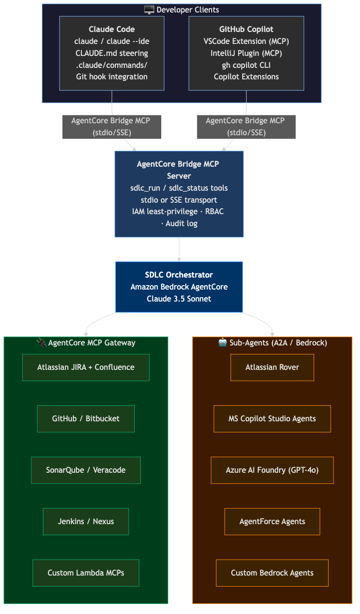
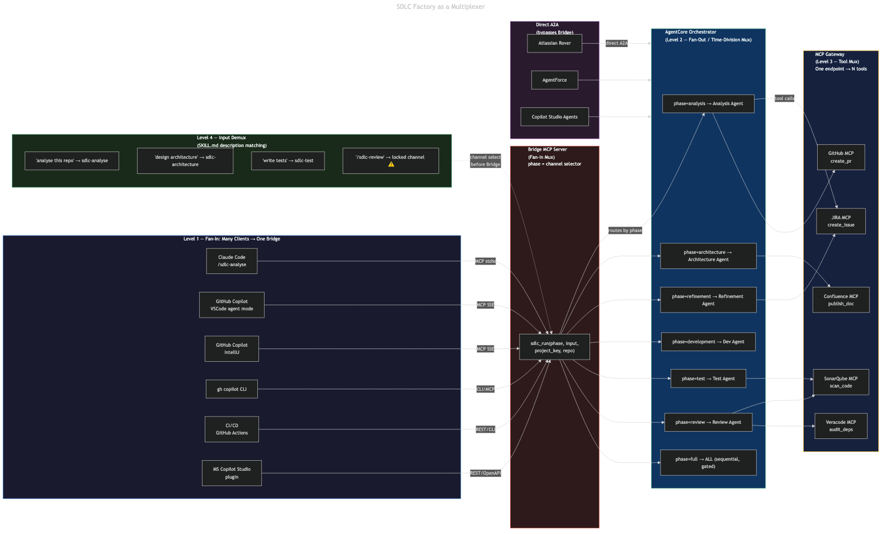
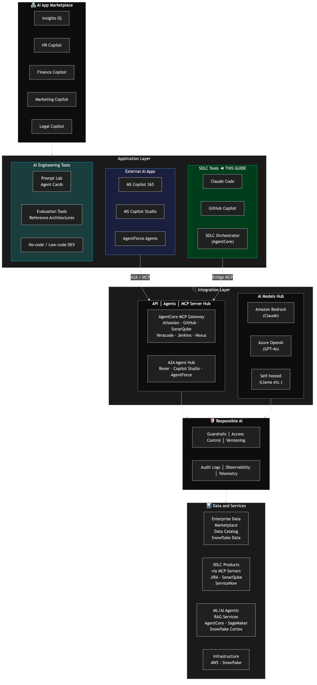
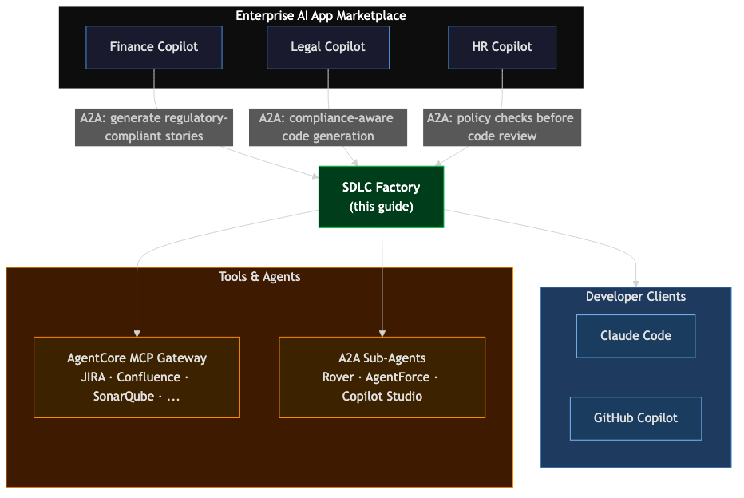
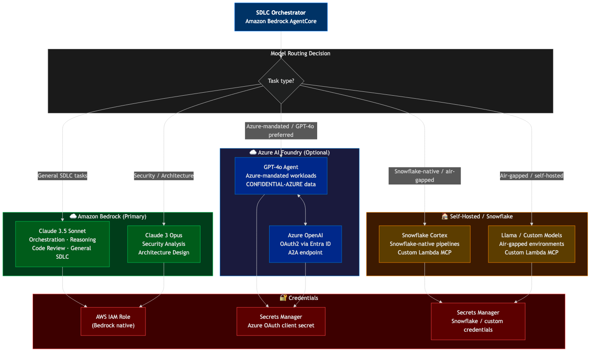
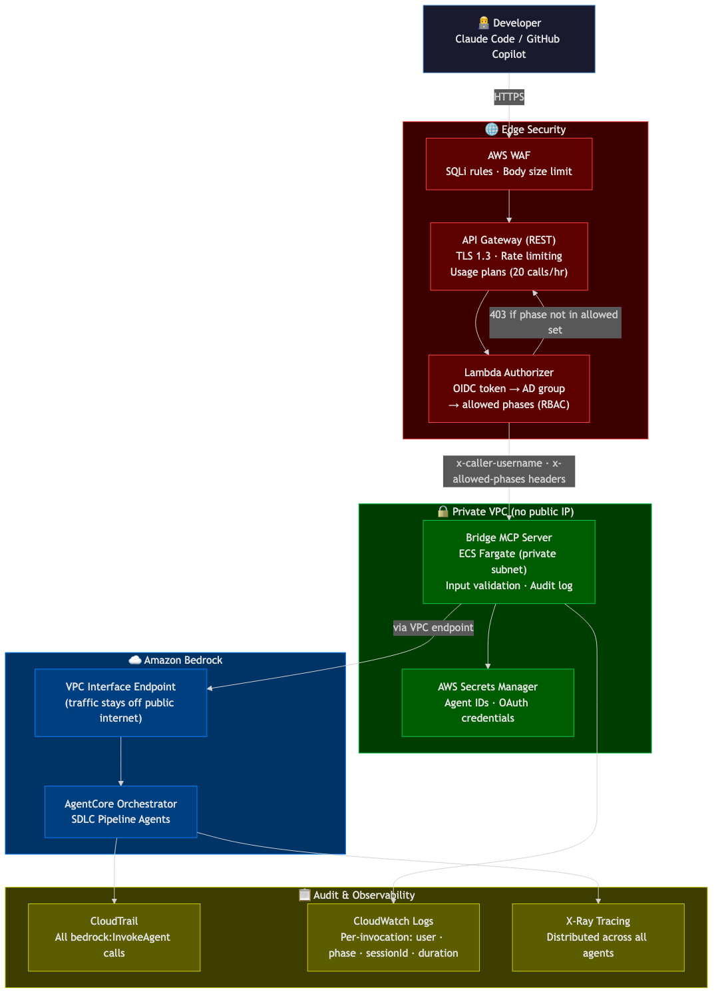
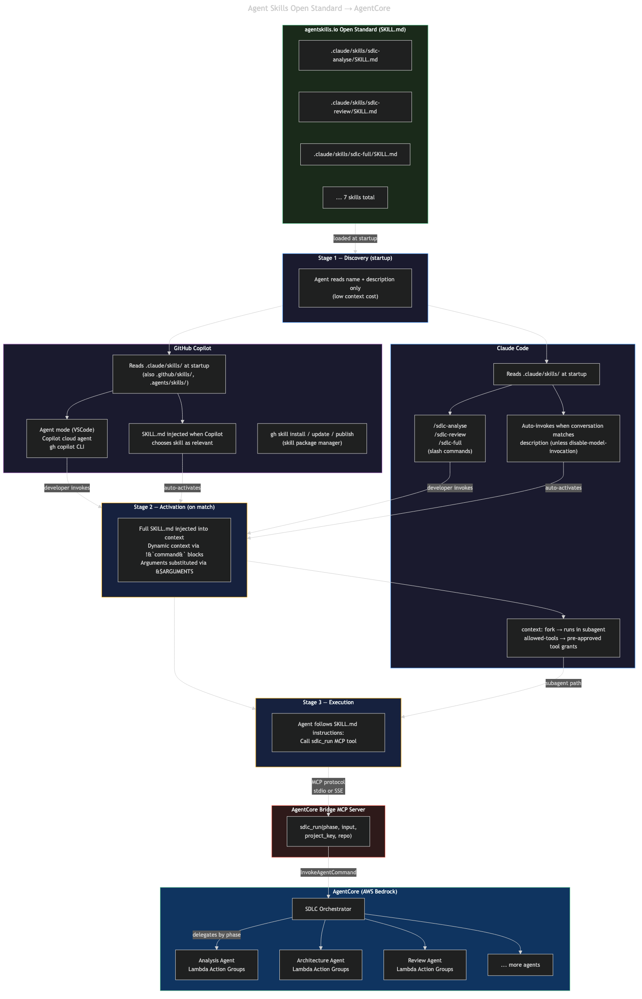
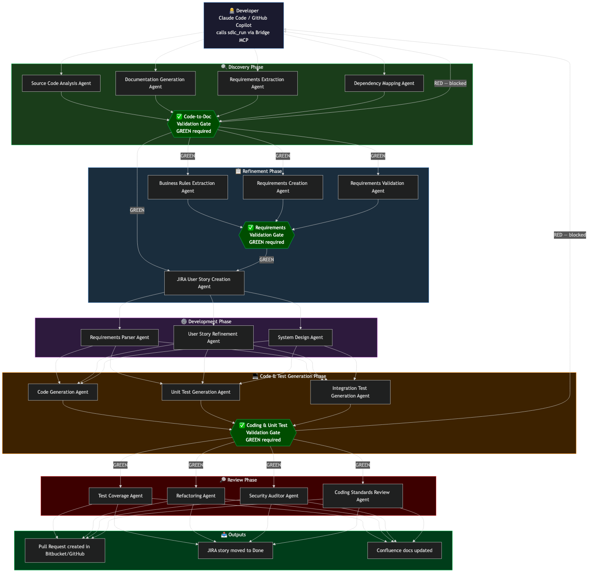

# AI SDLC Factory — Step-by-Step Implementation Guide

> **Goal:** Build the "AI SDLC Factory – Enabling Governed Autonomy" pipeline shown in the architecture diagram, connecting every component through **Claude Code** and **GitHub Copilot** (VSCode, IntelliJ, CLI) as the developer-facing clients instead of Amazon Kiro or Amazon Q Developer.

---

## What You Are Building

The factory is a fully automated, AI-governed Software Development Lifecycle (SDLC) pipeline with three macro-phases:

| Phase | Stages |
|---|---|
| **Discovery Generation** | Analysis → Architecture |
| **Backlog Generation** | Refinement → Development |
| **Code & Test Generation** | Test → Review |

All phases are orchestrated by **Amazon Bedrock AgentCore**, exposed to developers through **Claude Code** (CLI + any IDE) and **GitHub Copilot** (VSCode, IntelliJ, CLI), and grounded in enterprise tools via **MCP Servers**.

### How Third-Party Tools and Agents Connect

This guide has been updated to reflect the preferred integration patterns shown in the architecture diagrams:

**Option A — Official/Vendor MCP Servers via AgentCore MCP Gateway (preferred)**
Atlassian (JIRA, Confluence), SonarQube, GitHub, and many others publish **official MCP servers**. Rather than building custom Lambda wrappers, you register these directly in the **AgentCore MCP Gateway**. The gateway aggregates all MCP servers behind a single managed endpoint, handles authentication centrally, and applies guardrails uniformly. Agents call tools through the gateway — no per-tool Lambda required.

**Option B — Third-Party Specialist Agents as Sub-Agents via A2A**
Specialized AI agents — such as **Atlassian Rover** (requirements elicitation and backlog creation), Salesforce AgentForce agents, or Microsoft Copilot Studio agents — can be wired directly into AgentCore as **sub-agents** using the **Agent-to-Agent (A2A) protocol** or Bedrock's multi-agent collaboration. The SDLC Orchestrator delegates work to them exactly as it delegates to its own Bedrock sub-agents. This means Rover's requirements intelligence, for example, can participate in the Discovery/Refinement pipeline without any wrapping or re-implementation.

**Option C — Custom Lambda MCP Servers (last resort)**
Build custom Lambda-backed MCP servers only for internal/proprietary tools that have no official MCP server and no A2A endpoint (e.g. internal mainframe repos, bespoke coding standards databases).

<!-- diagram:01-sdlc-factory-overview -->
```
  ┌──────────────────────────────┐    ┌─────────────────────────────────────┐
  │      Claude Code (CLI)       │    │         GitHub Copilot              │
  │  ─────────────────────────  │    │  ────────────────────────────────   │
  │  claude / claude --ide       │    │  VSCode Extension (MCP)             │
  │  CLAUDE.md steering          │    │  IntelliJ Plugin  (MCP)             │
  │  .claude/commands/           │    │  gh copilot CLI                     │
  │  Git hook integration        │    │  Copilot Extensions (@sdlc-factory) │
  └──────────┬───────────────────┘    └───────────────┬─────────────────────┘
             │  AgentCore Bridge MCP                  │  AgentCore Bridge MCP
             │  (stdio/SSE transport)                 │  (stdio/SSE transport)
             └─────────────────┬──────────────────────┘
                               ▼
                    ┌─────────────────────────────────────────────────┐
                    │         SDLC Orchestrator (AgentCore)           │
                    └──────────┬───────────────────────┬──────────────┘
                               │                       │
              ┌────────────────▼──────┐    ┌───────────▼──────────────────┐
              │  AgentCore MCP Gateway│    │  Sub-Agents (A2A / Bedrock)  │
              │  ─────────────────── │    │  ──────────────────────────  │
              │  • Atlassian JIRA MCP │    │  • Atlassian Rover           │
              │  • Confluence MCP     │    │  • AgentForce Agents         │
              │  • GitHub MCP         │    │  • Custom Bedrock Agents     │
              │  • SonarQube MCP      │    │  • MS Copilot Studio Agents  │
              │  • Veracode MCP       │    └──────────────────────────────┘
              │  • Jenkins MCP        │
              │  • Nexus MCP          │
              │  • Custom Lambda MCPs │
              └───────────────────────┘
```

> **Mermaid diagram:** [`diagrams/01-sdlc-factory-overview.mmd`](./diagrams/01-sdlc-factory-overview.mmd)
>
> 

---

## How the System Works as a Multiplexer

The SDLC Factory is architecturally a **nested multiplexer** — it operates in both directions simultaneously: fanning many clients into one API (fan-in), and fanning one request out across many agents and tools (fan-out). Understanding this is key to understanding why the system scales cleanly when you add new clients, agents, or tools.

```
LEVEL 4           LEVEL 1              CHANNEL        LEVEL 2              LEVEL 3
Input Demux       Fan-In Mux           Selector       Fan-Out Mux          Tool Mux
(Skills)          (Bridge)             (phase)        (Orchestrator)       (MCP Gateway)

'analyse repo'─┐
               │  Claude Code    ─┐
'design arch'─┐│  Copilot VSCode ─┤               ┌─► Analysis Agent ──► JIRA
              ││  Copilot IJ     ─┤  sdlc_run()   ├─► Architecture   ──► Confluence
'write tests'─┤├─► SKILL.md  ────┼─► Bridge  ────┼─► Refinement     ──► GitHub MCP
              ││  gh copilot     ─┤  phase=        ├─► Dev Agent      ──► SonarQube
'/sdlc-review'┘│  CI/CD Actions  ─┤  channel      ├─► Test Agent     ──► Veracode
  ⚠️ locked    │  Copilot Studio ─┘  selector     └─► Review Agent   ──► Jenkins
               └──────────────────────────────────────────────────────────────────
                                                   ▲
               Atlassian Rover  ──────── A2A ──────┘  (direct — bypasses Bridge)
               AgentForce       ──────── A2A ──────┘
               Copilot Studio   ──────── A2A ──────┘
```

> **Mermaid diagram:** [`diagrams/08-multiplexer-architecture.mmd`](./diagrams/08-multiplexer-architecture.mmd)
>
> 

---

### Level 1 — Bridge MCP Server: Fan-In Mux (Many Clients → One API)

Six different clients with six different protocols all collapse into a single `InvokeAgentCommand` AWS API call. The Bridge is the **fan-in multiplexer**:

```
┌──────────────────────────────────────────────────────────────────────────────────┐
│                        LEVEL 1 — FAN-IN MULTIPLEXER                              │
│               (Many clients, many protocols → One Bridge endpoint)               │
├──────────────────────────────────────────────────────────────────────────────────┤
│                                                                                  │
│  ┌──────────────────────────┐  MCP stdio (IPC)    ┌──────────────────────────┐  │
│  │  Claude Code             ├────────────────────►│                          │  │
│  │  /sdlc-analyse           │                     │   AgentCore Bridge       │  │
│  ├──────────────────────────┤  MCP SSE (HTTP/2)   │   MCP Server             │  │
│  │  GitHub Copilot (VSCode) ├────────────────────►│                          │  │
│  │  agent mode              │                     │   sdlc_run(              │  │
│  ├──────────────────────────┤  MCP SSE (HTTP/2)   │     phase,               │  │
│  │  GitHub Copilot (IJ)     ├────────────────────►│     input,               │  │
│  │  plugin                  │                     │     project_key,         │  │
│  ├──────────────────────────┤  MCP / CLI          │     repo                 │  │
│  │  gh copilot CLI          ├────────────────────►│   )                      │  │
│  ├──────────────────────────┤  REST / CLI script  │         │                │  │
│  │  CI/CD GitHub Actions    ├────────────────────►│         ▼                │  │
│  │  pre-merge workflow      │                     │  InvokeAgentCommand      │  │
│  ├──────────────────────────┤  REST / OpenAPI     │  ────────────────────    │  │
│  │  MS Copilot Studio       ├────────────────────►│  → AgentCore Orchestr.   │  │
│  └──────────────────────────┘                     └──────────────────────────┘  │
│                                                                                  │
│  ┌──────────────────────────┐  A2A direct (bypasses Bridge entirely)             │
│  │  Atlassian Rover         ├──────────────────────────────────────────────────► │
│  │  AgentForce / Others     │  → hits Orchestrator directly via agent protocol   │
│  └──────────────────────────┘                                                    │
│                                                                                  │
│  Adding a new client = add 1 MCP config. Zero changes to agents or tools.        │
└──────────────────────────────────────────────────────────────────────────────────┘
```

---

### Level 2 — AgentCore Orchestrator: Fan-Out / Time-Division Mux (One Request → Many Agents)

A single `sdlc_run(phase="full")` call is **time-division multiplexed** across six sequential agents. Each agent's output becomes the next agent's input. The GREEN/RED gate at each phase is the **mux guard** — a RED signal stops all downstream channels:

```
┌──────────────────────────────────────────────────────────────────────────────────┐
│              LEVEL 2 — FAN-OUT / TIME-DIVISION MULTIPLEXER                       │
│           (One request → N agents sequentially, gated between each)              │
├──────────────────────────────────────────────────────────────────────────────────┤
│                                                                                  │
│   sdlc_run(phase="full")                                                         │
│          │                                                                       │
│          ▼                                                                       │
│   ┌────────────────────────────────────────────────────────────────────────┐     │
│   │  SDLC Orchestrator (AgentCore)                                         │     │
│   │  phase="full"     → all channels in sequence                           │     │
│   │  phase="analysis" → channel 1 only (1-of-N selector)                  │     │
│   └────────┬───────────────────────────────────────────────────────────────┘     │
│            │                                                                     │
│   ┌────────▼────────────────────────────────────────────────────────────────┐   │
│   │ [ch 1]  Analysis Agent (analyze-requirements)                           │   │
│   │         output ──► ✅ GREEN → feeds ch 2  │  🔴 RED → pipeline stops   │   │
│   ├─────────────────────────────────────────────────────────────────────────┤   │
│   │ [ch 2]  Architecture Agent (generate-architecture)                      │   │
│   │         output ──► ✅ GREEN → feeds ch 3  │  🔴 RED → pipeline stops   │   │
│   ├─────────────────────────────────────────────────────────────────────────┤   │
│   │ [ch 3]  Refinement Agent (create-backlog)                               │   │
│   │         output ──► ✅ GREEN → feeds ch 4  │  🔴 RED → pipeline stops   │   │
│   ├─────────────────────────────────────────────────────────────────────────┤   │
│   │ [ch 4]  Development Agent (generate-code)                               │   │
│   │         output ──► ✅ GREEN → feeds ch 5  │  🔴 RED → pipeline stops   │   │
│   ├─────────────────────────────────────────────────────────────────────────┤   │
│   │ [ch 5]  Test Agent (run-tests, coverage-check)                          │   │
│   │         output ──► ✅ GREEN → feeds ch 6  │  🔴 RED → pipeline stops   │   │
│   ├─────────────────────────────────────────────────────────────────────────┤   │
│   │ [ch 6]  Review Agent (security-audit, compliance)                       │   │
│   │         output ──► ✅ GREEN → result to client │ 🔴 RED → block merge  │   │
│   └─────────────────────────────────────────────────────────────────────────┘   │
└──────────────────────────────────────────────────────────────────────────────────┘
```

For single-phase calls (`phase="analysis"`, `phase="review"`) the Orchestrator selects only that channel — acting as a **1-of-N selector**.

---

### Level 3 — MCP Gateway: Tool Mux (One Agent Endpoint → Many External Systems)

Every AgentCore agent calls **one endpoint**: the MCP Gateway. The Gateway is the **tool demultiplexer** — it routes tool names to the right backend:

```
┌──────────────────────────────────────────────────────────────────────────────────┐
│                    LEVEL 3 — TOOL DEMULTIPLEXER (MCP Gateway)                    │
│            (One endpoint → N external systems, routed by tool name)              │
├──────────────────────────────────────────────────────────────────────────────────┤
│                                                                                  │
│   Any AgentCore Agent calls ONE endpoint:                                        │
│         mcp-gateway.internal/invoke                                              │
│                       │                                                          │
│          tool name ───┼──────────────────────────────────────────               │
│                       │                                                          │
│         ┌─────────────┼────────────────┬───────────────────────┐                │
│         ▼             ▼                ▼                       ▼                │
│  ┌──────────────┐ ┌──────────────┐ ┌──────────────┐ ┌──────────────────┐       │
│  │  JIRA MCP    │ │  GitHub MCP  │ │ SonarQube MCP│ │  Confluence MCP  │       │
│  │  ──────────  │ │  ──────────  │ │  ──────────  │ │  ─────────────   │       │
│  │  create_issue│ │  create_pr   │ │  scan_code   │ │  publish_doc     │       │
│  │  search_issue│ │  search_code │ │  get_findings│ │  search_docs     │       │
│  │  add_comment │ │  merge_pr    │ │  get_quality │ │  update_page     │       │
│  └──────────────┘ └──────────────┘ └──────────────┘ └──────────────────┘       │
│         ▼             ▼                ▼                       ▼                │
│  ┌──────────────┐ ┌──────────────┐ ┌──────────────┐ ┌──────────────────┐       │
│  │  Veracode MCP│ │  Jenkins MCP │ │  (any new    │ │  (any new tool)  │       │
│  │  ──────────  │ │  ──────────  │ │   tool)      │ │  Register 1 MCP  │       │
│  │  audit_deps  │ │  trigger_bld │ │  Datadog MCP │ │  server. Zero    │       │
│  │  get_cves    │ │  get_status  │ │  PagerDuty   │ │  agent changes.  │       │
│  │  get_report  │ │  get_logs    │ │  Nexus MCP   │ │                  │       │
│  └──────────────┘ └──────────────┘ └──────────────┘ └──────────────────┘       │
└──────────────────────────────────────────────────────────────────────────────────┘
```

Adding a new tool (Datadog, PagerDuty, Nexus) means registering one MCP server in the Gateway. Zero changes to any agent or client.

---

### Level 4 — Skills: Input Demux (One Conversation → Right Skill → Right Channel)

At the IDE level, the `description` field in each `SKILL.md` is the **input demultiplexer** — the model reads all descriptions at startup and selects the matching skill when the developer's intent arrives:

```
┌──────────────────────────────────────────────────────────────────────────────────┐
│                    LEVEL 4 — INPUT DEMULTIPLEXER (Skills)                        │
│        (Developer intent → SKILL.md description match → Bridge channel)         │
├──────────────────────────────────────────────────────────────────────────────────┤
│                                                                                  │
│  Developer types natural language or /skill-name                                 │
│          │                                                                       │
│          ▼  description matching (Discovery stage, runs at startup)              │
│                                                                                  │
│  ┌──────────────────────────┬──────────────────────────┬───────────────────┐    │
│  │  INPUT                   │  SKILL.md matched        │  CHANNEL          │    │
│  ├──────────────────────────┼──────────────────────────┼───────────────────┤    │
│  │  "analyse this repo"     │  sdlc-analyse/SKILL.md   │  phase=analysis   │    │
│  │  "analyse requirements"  │  (auto-triggered)        │  ──────────────── │    │
│  ├──────────────────────────┼──────────────────────────┼───────────────────┤    │
│  │  "design architecture"   │  sdlc-architecture/      │  phase=arch.      │    │
│  │  "design the system"     │  SKILL.md (auto)         │  ──────────────── │    │
│  ├──────────────────────────┼──────────────────────────┼───────────────────┤    │
│  │  "generate user stories" │  sdlc-backlog/SKILL.md   │  phase=refinement │    │
│  │  "create backlog"        │  (auto-triggered)        │  ──────────────── │    │
│  ├──────────────────────────┼──────────────────────────┼───────────────────┤    │
│  │  "implement the API"     │  sdlc-codegen/SKILL.md   │  phase=development│    │
│  │  "write the code"        │  (auto-triggered)        │  ──────────────── │    │
│  ├──────────────────────────┼──────────────────────────┼───────────────────┤    │
│  │  "write tests for auth"  │  sdlc-test/SKILL.md      │  phase=test       │    │
│  │  "add test coverage"     │  (auto-triggered)        │  ──────────────── │    │
│  ├──────────────────────────┼──────────────────────────┼───────────────────┤    │
│  │  anything else           │  sdlc-review/SKILL.md    │  ⛔ LOCKED         │    │
│  │  ← model CANNOT select   │  disable-model-          │  must type        │    │
│  │    automatically         │  invocation: true        │  /sdlc-review     │    │
│  ├──────────────────────────┼──────────────────────────┼───────────────────┤    │
│  │  anything else           │  sdlc-full/SKILL.md      │  ⛔ LOCKED         │    │
│  │  ← model CANNOT select   │  disable-model-          │  must type        │    │
│  │    automatically         │  invocation: true        │  /sdlc-full       │    │
│  └──────────────────────────┴──────────────────────────┴───────────────────┘    │
│          │                                                                       │
│          ▼  Skill activated → full SKILL.md injected → agent calls sdlc_run()   │
│          └──────────────────────────────────────────────────► Bridge (Level 1)  │
│                                                                                  │
│  Same SKILL.md works in both Claude Code and GitHub Copilot (agentskills.io)    │
└──────────────────────────────────────────────────────────────────────────────────┘
```

`disable-model-invocation: true` on `sdlc-review` and `sdlc-full` is a **hard-wired locked channel** — the input demux cannot auto-select it, preventing accidental pipeline runs or blocked commits.

---

### Why the Multiplexer Design Matters

| Concern | Without mux | With mux |
|---|---|---|
| Add a new IDE client | Update every agent | Add 1 MCP config to Bridge |
| Add a new external tool | Update every agent that needs it | Register 1 MCP server in Gateway |
| Add a new SDLC phase | Rebuild all clients | Add 1 new AgentCore sub-agent + 1 `SKILL.md` |
| Audit who called what | Scattered logs per client | Bridge logs every call: caller, phase, project, session |
| Enforce guardrails | Repeat in every client | Bedrock Guardrails applied once at AgentCore layer |
| Scale to 100 developers | N×6 integration points | 1 Bridge endpoint (scales horizontally) |

---

The SDLC Factory is **one application** within a broader enterprise AI App Marketplace. Understanding where it sits in the full picture is essential before implementation. The diagram below maps the five-layer enterprise architecture to the components built in this guide.

### Five-Layer Architecture Map

```
┌────────────────────────────────────────────────────────────────────────────────────┐
│                            AI APP MARKETPLACE                                      │
│   Insights IQ │ HR Copilot │ Finance Copilot │ Marketing Copilot │ Legal Copilot  │
│                                                                                    │
│  ┌─────────────────────┐  ┌──────────────────────┐  ┌──────────────────────────┐  │
│  │  External AI Apps   │  │    SDLC Tools        │  │  AI Engineering Tools    │  │
│  │  ─────────────────  │  │  ─────────────────── │  │  ─────────────────────── │  │
│  │  MS Copilot 365     │  │  ◄─ THIS GUIDE ─►    │  │  Prompt Lab              │  │
│  │  MS Copilot Studio  │  │  Claude Code         │  │  MCP Tools / Agent Cards │  │
│  │  AgentForce Agents  │  │  GitHub Copilot      │  │  No-code / Low-code DEV  │  │
│  │  (Salesforce)       │  │  SDLC Orchestrator   │  │  Evaluation Tools        │  │
│  │                     │  │  (AgentCore)         │  │  Reference Architectures │  │
│  └──────────┬──────────┘  └──────────┬───────────┘  └──────────────────────────┘  │
└─────────────┼───────────────────────┼──────────────────────────────────────────────┘
              │ A2A / MCP             │ Bridge MCP
              ▼                       ▼
┌────────────────────────────────────────────────────────────────────────────────────┐
│                          INTEGRATION LAYER                                         │
│                                                                                    │
│         Tools via MCP              Agents via A2A           Models via API        │
│  ┌─────────────────────────────────────────────┐   ┌────────────────────────────┐ │
│  │        API │ Agents │ MCP Server Hub         │   │      AI Models Hub         │ │
│  │  ─────────────────────────────────────────  │   │  ──────────────────────    │ │
│  │  AgentCore MCP Gateway                       │   │  Amazon Bedrock (Claude)   │ │
│  │   • Atlassian (JIRA/Confluence)              │   │  Azure OpenAI (GPT-4o)     │ │
│  │   • GitHub / Bitbucket                       │   │  Self-hosted (Llama etc.)  │ │
│  │   • SonarQube / Veracode                     │   └────────────────────────────┘ │
│  │   • Jenkins / Nexus                          │                                  │
│  │   • Custom Lambda MCPs                       │                                  │
│  └─────────────────────────────────────────────┘                                  │
└────────────────────────────────────────────────────────────────────────────────────┘
              │                       │                         │
              ▼                       ▼                         ▼
┌────────────────────────────────────────────────────────────────────────────────────┐
│                           RESPONSIBLE AI                                           │
│         Guardrails │ Access Control │ Versioning │ Audit Logs │ Observability      │
│         (Bedrock Guardrails + Bridge RBAC + CloudTrail + CloudWatch)               │
└────────────────────────────────────────────────────────────────────────────────────┘
              │
              ▼
┌────────────────────────────────────────────────────────────────────────────────────┐
│                          DATA AND SERVICES                                         │
│                                                                                    │
│  Enterprise Data      SDLC Products           ML/AI Agentic         Infrastructure│
│  Marketplace          (via MCP Servers)        RAG Services                        │
│  ─────────────────    ─────────────────────    ──────────────────    ──────────── │
│  Data Catalog         Coding Standards    Snowflake Cortex      AWS          │
│  Snowflake Data       JIRA                     Amazon Bedrock        Snowflake    │
│                       SonarQube/Qube Reports   AgentCore / SM                     │
│                       ServiceNow               Azure AI Foundry                   │
└────────────────────────────────────────────────────────────────────────────────────┘
```

> **Mermaid diagram:** [`diagrams/02-enterprise-marketplace.mmd`](./diagrams/02-enterprise-marketplace.mmd)
>
> 

### Where Each Part of This Guide Maps

| Architecture Layer | Component in This Guide | Steps Covered |
|---|---|---|
| **SDLC Tools** | SDLC Orchestrator (AgentCore), Claude Code, GitHub Copilot, Bridge MCP Server | Steps 1–4, 5B, 6, 7 |
| **Integration Layer — API/Agents/MCP Hub** | AgentCore MCP Gateway + A2A sub-agents | Steps 5, 5A |
| **Integration Layer — AI Models Hub** | Bedrock (Claude 3.5 Sonnet) primary; Azure OpenAI via Azure AI Foundry sub-agents | §0.3 below + Step 5A |
| **Responsible AI** | Bedrock Guardrails, Bridge RBAC, CloudTrail, IAM least-privilege | Steps 5B.3, 9 |
| **Data & Services — SDLC Products** | JIRA, SonarQube, Confluence, Jenkins, Nexus, Veracode registered as MCP servers | Step 5 |
| **External AI Apps → SDLC Factory** | MS Copilot 365 plugin, MS Copilot Studio agents, AgentForce agents via A2A | §0.4 below + Step 5A |
| **AI Engineering Tools** | Agent Cards, Prompt Library patterns | Step 9 |

---

### 0.1 — Placing the SDLC Factory in the Marketplace

The SDLC Factory is deployed as a **catalogued application** in the enterprise AI App Marketplace. Other business-domain copilots (HR, Finance, Legal) can call it for SDLC-related work, and it in turn calls External AI Apps as sub-agents (Rover for requirements, AgentForce for CRM-linked stories, Copilot Studio agents for domain policies).

```
Enterprise AI App Marketplace
│
├── Finance Copilot ──────────────────────────────────────────────────┐
│                                                                      │ A2A: "generate
├── Legal Copilot ────────────────────────────────────────────────────┤  regulatory-compliant
│                                                                      │  user stories"
└── SDLC Factory (this guide) ◄────────────────────────────────────────┘
         │
         ├── Claude Code / GitHub Copilot (developer clients)
         ├── AgentCore MCP Gateway ─── JIRA, Confluence, SonarQube, ...
         └── A2A Sub-Agents ─────────── Rover, AgentForce, Copilot Studio agents
```

> **Mermaid diagram:** [`diagrams/03-marketplace-positioning.mmd`](./diagrams/03-marketplace-positioning.mmd)
>
> 

---

### 0.2 — AI Models Hub: Multi-Cloud Model Routing

The **AI Models Hub** in the architecture diagram shows that the enterprise is NOT locked to a single model provider. The SDLC Factory supports this through three patterns:

| Pattern | Use Case | Configuration |
|---|---|---|
| **Amazon Bedrock (Claude)** — Primary | Orchestration, reasoning, code review, all general SDLC tasks | `FoundationModel: anthropic.claude-3-5-sonnet-20241022-v2:0` in AgentCore |
| **Azure OpenAI (GPT-4o)** — via Azure AI Foundry sub-agent | Tasks where GPT-4o performs better, or where Azure is the mandated provider | Register Azure AI Foundry agent as A2A sub-agent (see §0.3) |
| **Self-hosted / Snowflake Cortex** — via custom Lambda MCP | Air-gapped environments, highly sensitive data, Snowflake-native data pipelines | Custom Lambda MCP wrapping the model endpoint |

#### 0.2.1 Configure AgentCore to Use Multiple Models

Each Bedrock agent in the SDLC Factory can use a **different foundation model** based on task fit:

```yaml
# template.yaml — per-agent model selection
CodeGenerationAgent:
  Type: AWS::Bedrock::Agent
  Properties:
    AgentName: SDLC-CodeGeneration
    FoundationModel: anthropic.claude-3-5-sonnet-20241022-v2:0  # Best for code
    ...

SecurityAuditorAgent:
  Type: AWS::Bedrock::Agent
  Properties:
    AgentName: SDLC-SecurityAuditor
    FoundationModel: anthropic.claude-3-opus-20240229-v1:0      # Best for security analysis
    ...
```

> **Mermaid diagram:** [`diagrams/06-multicloud-model-routing.mmd`](./diagrams/06-multicloud-model-routing.mmd)
>
> 

---

### 0.3 — Azure OpenAI Integration via Azure AI Foundry A2A

To route specific tasks to Azure OpenAI GPT-4o (e.g., if it is the enterprise's mandated model for certain data classifications, or if the Azure estate is the primary cloud):

**Step 1: Create the Azure AI Foundry Agent**

In your Azure portal, create an AI Foundry agent backed by GPT-4o:

```bash
# Azure CLI
az cognitiveservices account create \
  --name sdlc-gpt4o \
  --resource-group sdlc-rg \
  --kind OpenAI \
  --sku S0 \
  --location eastus

# Create an AI Foundry project + agent via Azure AI Studio
# → The agent gets an endpoint like:
# https://<foundry-endpoint>.azure.com/agents/v1.0/<agent-id>
```

**Step 2: Register as A2A Sub-Agent in AgentCore**

```bash
aws bedrock-agent associate-agent-collaborator \
  --agent-id <sdlc-orchestrator-id> \
  --agent-alias-id <alias-id> \
  --collaborator-name "AzureGPT4oSpecialist" \
  --collaborator-descriptor '{
    "a2aEndpointUrl": "https://<foundry-endpoint>.azure.com/agents/v1.0/<agent-id>",
    "authConfig": {
      "type": "OAUTH2",
      "clientId":     "<azure-app-client-id>",
      "clientSecret": "{{resolve:secretsmanager:sdlc/azure-ai/oauth}}",
      "tokenUrl":     "https://login.microsoftonline.com/<tenant>/oauth2/v2.0/token",
      "scopes":       ["https://cognitiveservices.azure.com/.default"]
    }
  }' \
  --relay-conversation-history TO_COLLABORATOR \
  --region eu-west-2
```

**Step 3: Route Tasks to Azure GPT-4o in the Orchestrator's Instructions**

In the SDLC Orchestrator system prompt, add routing logic:

```
When the task involves processing data classified as CONFIDENTIAL-AZURE or 
when the user specifies GPT-4o, delegate to the AzureGPT4oSpecialist sub-agent.
For all other tasks, use the Bedrock-native specialist agents.
```

**Store Azure credentials in Secrets Manager:**

```bash
aws secretsmanager create-secret \
  --name "sdlc/azure-ai/oauth" \
  --secret-string '{"clientSecret":"<your-azure-app-secret>"}' \
  --region eu-west-2
```

---

### 0.4 — External AI Apps: MS Copilot 365, Copilot Studio, and AgentForce

The **External AI Apps** column in the marketplace (MS Copilot, MS Copilot Studio, AgentForce) can interact with the SDLC Factory in two directions:

| Direction | Pattern | Use Case |
|---|---|---|
| **External app → SDLC Factory** | App calls SDLC Factory's MCP/API | MS Copilot 365 "ask SDLC factory to generate user stories from this meeting transcript" |
| **SDLC Factory → External app** | SDLC Factory delegates to external agent as A2A sub-agent | Orchestrator delegates requirements work to Rover or Copilot Studio agent |

#### Direction 1: MS Copilot 365 Calling the SDLC Factory

MS Copilot 365 (in Teams, Word, Outlook) can call enterprise APIs via **Copilot Studio plugins** (REST actions + OpenAPI spec). Expose the AgentCore Bridge as a REST API and declare it as a plugin:

```yaml
# openapi.yaml — expose SDLC Factory as a Copilot Studio plugin
openapi: 3.0.0
info:
  title: SDLC Factory API
  version: "1.0"
paths:
  /sdlc/run:
    post:
      operationId: runSDLCPhase
      summary: Execute an SDLC pipeline phase
      requestBody:
        required: true
        content:
          application/json:
            schema:
              type: object
              properties:
                phase:       { type: string, enum: [analysis, architecture, refinement, development, test, review, full] }
                input:       { type: string, maxLength: 8000 }
                project_key: { type: string }
                repo:        { type: string }
              required: [phase, input]
      responses:
        "200":
          description: Pipeline phase output
          content:
            application/json:
              schema:
                type: object
                properties:
                  result:     { type: string }
                  session_id: { type: string }
                  status:     { type: string, enum: [GREEN, RED, IN_PROGRESS] }
```

Deploy this OpenAPI spec behind API Gateway (same Lambda as the Bridge SSE server). In **Copilot Studio**, create a new plugin pointing to this endpoint. Enterprise users in Teams can then say:

```
"@SDLC Factory, analyse our payments service repo for this sprint"
→ MS Copilot calls runSDLCPhase(phase="analysis", repo="payments-service", ...)
→ AgentCore Orchestrator runs the full Discovery pipeline
→ Results streamed back into the Teams chat
```

#### Direction 2: MS Copilot Studio Agents as A2A Sub-Agents

Copilot Studio agents can be published with an **A2A endpoint** (Azure AI Foundry backs Copilot Studio agents from 2025). Register them as sub-agents in AgentCore exactly like Rover:

```bash
# Example: A Copilot Studio "Compliance Policy Agent" that knows HR/Legal policies
aws bedrock-agent associate-agent-collaborator \
  --agent-id <sdlc-orchestrator-id> \
  --agent-alias-id <alias-id> \
  --collaborator-name "CopilotStudioComplianceAgent" \
  --collaborator-descriptor '{
    "a2aEndpointUrl": "https://<copilot-studio-agent-endpoint>.microsoft.com/v1/agents/<agent-id>",
    "authConfig": {
      "type": "OAUTH2",
      "clientId":     "<entra-app-id>",
      "clientSecret": "{{resolve:secretsmanager:sdlc/copilot-studio/oauth}}",
      "tokenUrl":     "https://login.microsoftonline.com/<tenant>/oauth2/v2.0/token",
      "scopes":       ["https://copilotstudio.microsoft.com/.default"]
    }
  }' \
  --relay-conversation-history TO_COLLABORATOR
```

Then in the SDLC Orchestrator system prompt, delegate to it for policy-sensitive phases:

```
When generating code or test cases that touch financial transactions, 
regulatory data, or PII fields, first consult CopilotStudioComplianceAgent 
to validate against compliance policy before proceeding.
```

#### Direction 3: AgentForce (Salesforce) Agents as A2A Sub-Agents

Salesforce AgentForce agents expose an A2A endpoint. Use them to pull CRM-linked requirements (customer feedback, support tickets → user stories):

```bash
aws bedrock-agent associate-agent-collaborator \
  --agent-id <sdlc-orchestrator-id> \
  --agent-alias-id <alias-id> \
  --collaborator-name "AgentForceRequirementsAgent" \
  --collaborator-descriptor '{
    "a2aEndpointUrl": "https://<salesforce-org>.salesforce.com/services/agent/v1/<agent-id>",
    "authConfig": {
      "type": "OAUTH2",
      "tokenUrl":     "https://<salesforce-org>.salesforce.com/services/oauth2/token",
      "clientId":     "<connected-app-id>",
      "clientSecret": "{{resolve:secretsmanager:sdlc/salesforce/oauth}}"
    }
  }' \
  --relay-conversation-history TO_COLLABORATOR
```

---

### 0.5 — Responsible AI Layer: How This Guide Covers It

The Responsible AI cross-cut in the marketplace architecture maps directly to controls documented in this guide:

| Responsible AI Control | Implementation | Guide Section |
|---|---|---|
| **Guardrails** | Bedrock Guardrails on the Orchestrator agent + all sub-agents | Step 9 |
| **Access Control** | IAM least-privilege + OIDC RBAC on Bridge MCP Server | Step 5B.3 |
| **Versioning** | AgentCore agent aliases (PROD/STAGING/DEV) — rollback by alias swap | Step 1 |
| **Audit Logs** | CloudTrail for all Bedrock calls; structured CloudWatch log per Bridge invocation | Step 5B.3, Step 9 |
| **Observability** | CloudWatch dashboards — latency, token consumption, GREEN/RED gate rates | Step 9 |
| **Telemetry** | X-Ray distributed tracing across AgentCore → MCP Gateway → sub-agents | Step 9 |

---

### 0.6 — Updated Prerequisites (Multi-Cloud)


| Tool | Purpose | Required? |
|---|---|---|
| AWS Account | Bedrock, AgentCore, IAM, S3, Lambda, DynamoDB | Required |
| **Claude Code** | CLI-first agentic coding tool (`npm install -g @anthropic-ai/claude-code`) | Required |
| **GitHub Copilot** | IDE + CLI AI — VSCode, IntelliJ, `gh copilot` CLI | Required |
| Node.js 20+ / Python 3.11+ | AgentCore Bridge MCP server + custom Lambda MCPs | Required |
| AWS SAM or CDK | Infrastructure as Code | Required |
| JIRA account | Backlog/story management — Atlassian official MCP server | Required |
| Bitbucket / GitHub | Source control — official MCP server | Required |
| SonarQube | Static analysis — official SonarQube MCP server | Required |
| Confluence | Documentation — Atlassian official MCP server | Required |
| Nexus | FOSS dependency management | Required |
| Jenkins / CloudBees | CI/CD pipeline | Required |
| Veracode | SAST/DAST security scanning | Required |
| CAST | Architecture analysis | Required |
| **Azure subscription** | Azure AI Foundry (GPT-4o sub-agents), Copilot Studio, Entra ID (OIDC) | Optional — multi-cloud |
| **MS Copilot Studio** | External AI App that calls SDLC Factory or acts as A2A sub-agent | Optional |
| **Salesforce (AgentForce)** | CRM-linked requirements via A2A | Optional |
| Atlassian Rover | AI agent for requirements elicitation — A2A sub-agent | Optional |

---

## Step 1 — Set Up the Orchestration Layer (Amazon Bedrock AgentCore)

This is the central nervous system. Every agent in every phase is registered here.

### 1.1 Enable Amazon Bedrock

```bash
aws bedrock list-foundation-models --region eu-west-2
```

Enable model access for:
- `anthropic.claude-3-5-sonnet-20241022-v2:0` — primary reasoning
- `anthropic.claude-3-haiku-20240307-v1:0` — fast/cheap tasks
- `amazon.titan-embed-text-v2:0` — embeddings for RAG

### 1.2 Create the AgentCore Orchestrator

In the AWS Console → **Bedrock → Agents → Create Agent**:

```
Name:        SDLC-Orchestrator
Model:       Claude 3.5 Sonnet
Instruction: You are the central SDLC orchestration agent. You receive
             a task (analysis, architecture, refinement, development,
             test, review) and route it to the correct specialist agent.
             Always validate outputs before passing to the next stage.
             Return structured JSON for every handoff.
```

- Enable **Code Interpreter** action group
- Enable **Knowledge Base** (connect to your Confluence/Docs S3 bucket)
- Set **Idle session TTL** to 3600 seconds

### 1.3 Create a Knowledge Base for Standards

```bash
# Create S3 bucket for standards documents
aws s3 mb s3://sdlc-factory-standards-<account-id>

# Upload coding standards, documentation standards, architecture patterns
aws s3 cp ./standards/ s3://sdlc-factory-standards-<account-id>/ --recursive
```

In Bedrock Console → **Knowledge Bases → Create**:
- Source: the S3 bucket above
- Embeddings model: `amazon.titan-embed-text-v2:0`
- Vector store: Amazon OpenSearch Serverless

Attach this Knowledge Base to the Orchestrator agent.

---

## Step 2 — Build the Discovery Generation Agents

### 2.1 Analysis Stage Agents

Create four Bedrock Agents, each as a **Lambda-backed action group**:

#### Agent 1: Source Code Analysis Agent

```bash
aws bedrock-agent create-agent \
  --agent-name "SourceCodeAnalysisAgent" \
  --foundation-model "anthropic.claude-3-5-sonnet-20241022-v2:0" \
  --instruction "Analyse source code repositories. Identify patterns, \
anti-patterns, tech debt, dependencies, and code quality issues. \
Return a structured JSON report with findings categorised by severity."
```

MCP Gateway tools used by this agent:
- **Bitbucket MCP Server** (fetch repo contents)
- **SonarQube MCP Server** (pull existing analysis)
- **CAST MCP Server** (architecture analysis)

#### Agent 2: Documentation Generation/Updater Agent

```
Instruction: Read existing source code and generate or update technical
documentation. Output Markdown/Confluence-compatible format. Cross-reference
with existing Confluence pages and flag outdated content.
```

MCP Gateway tools used by this agent:
- **Confluence MCP Server** (read/write pages)
- **Documentation Repos S3 MCP Server**

#### Agent 3: Requirements Extraction & Validation Agent

```
Instruction: Extract functional and non-functional requirements from
source code, comments, commit messages, and existing documentation.
Validate completeness against a requirements checklist. Output structured
requirements in JIRA-compatible format.
```

MCP Gateway tools used by this agent:
- **JIRA MCP Server** (read existing tickets)
- **Confluence MCP Server** (read specs)

#### Agent 4: Dependency Mapping Agent

```
Instruction: Map all internal and external dependencies for a given
codebase. Identify transitive dependencies, licence risks, and known
CVEs. Cross-reference with the Nexus FOSS repository.
```

MCP Gateway tools used by this agent:
- **Nexus (FOSS) MCP Server**
- **Bitbucket MCP Server**

### 2.2 Architecture Stage Agent

#### Agent 5: Code-to-Documentation Validation Agent *(highlighted in teal)*

This is the **gateway agent** between Analysis and Refinement — it validates that all analysis outputs are consistent before the pipeline proceeds.

```
Instruction: Receive outputs from all four Analysis agents. Cross-validate
that source code analysis, documentation, requirements, and dependency
maps are consistent and complete. Flag any gaps or contradictions.
Only pass a GREEN status to the Refinement stage when all checks pass.
```

---

## Step 3 — Build the Backlog Generation Agents

### 3.1 Refinement Stage Agents

#### Agent 6: Business Rules Extraction Agent

```
Instruction: From validated analysis outputs, extract explicit and implicit
business rules. Format as structured business rule statements with
priority, owner, and traceability to source artefacts.
```

#### Agent 7: Requirements Creation Agent

```
Instruction: Transform business rules and extracted requirements into
formal requirement statements following the template:
"As a [role], I need [capability] so that [business value]."
Ensure each requirement is testable, unambiguous, and traceable.
```

#### Agent 8: Requirements Validation Agent *(highlighted in teal)*

```
Instruction: Validate all requirements for completeness, consistency,
testability, and alignment with business rules. Apply INVEST criteria
to user stories. Return a validation report with PASS/FAIL per requirement.
```

#### Agent 9: JIRA User Story Creation Agent

```
Instruction: Convert validated requirements into JIRA user stories.
Create epics, stories, and sub-tasks with acceptance criteria, story
points estimate, and labels. Use the JIRA MCP Server to create tickets
directly in the configured project.
```

MCP Gateway tools used by this agent:
- **JIRA MCP Server** (create/update issues)

### 3.2 Development Stage Agents

#### Agent 10: Requirements Parser/Analyzer Agent

```
Instruction: Parse JIRA user stories and acceptance criteria. Decompose
complex stories into implementable tasks. Identify technical dependencies
between stories and flag blockers.
```

#### Agent 11: User Story Refinement Agent

```
Instruction: Refine user stories by adding technical implementation notes,
API contracts, data model changes, and test scenarios. Ensure stories
are ready for development (Definition of Ready met).
```

#### Agent 12: System Design Agent (Architecture Agent)

```
Instruction: For each refined user story, produce a system design proposal
including: component diagram, API design, data model changes, and
infrastructure requirements. Validate against existing architecture patterns
in the Knowledge Base.
```

---

## Step 4 — Build the Code & Test Generation Agents

### 4.1 Test Stage Agents

#### Agent 13: Code Generation Agent

```
Instruction: Generate production-ready code from system design proposals
and user stories. Follow the coding standards in the Knowledge Base.
Output code with inline documentation. Target language/framework is
determined by the repository context from Bitbucket.
```

MCP Gateway tools used by this agent:
- **Bitbucket MCP Server** (read repo, create branch, open PR)
- **Coding Standards MCP Server** (validate against standards)

#### Agent 14: Unit Test Generation Agent

```
Instruction: Generate comprehensive unit tests for all generated code.
Achieve minimum 80% line coverage and 100% branch coverage for business
logic. Use the testing framework already present in the repository.
```

#### Agent 15: Integration Test Generation Agent

```
Instruction: Generate integration tests covering all API contracts and
service boundaries identified in the system design. Include happy path,
error path, and boundary condition tests.
```

#### Agent 16: Coding and Unit Test Validation Agent *(highlighted in teal)*

```
Instruction: Execute generated code and tests in a sandbox environment.
Validate that all unit tests pass, coverage thresholds are met, and
no linting errors exist. Gate: only pass GREEN if all checks pass.
```

MCP Gateway tools used by this agent:
- **Jenkins/CloudBees MCP Server** (trigger build)
- **SonarQube MCP Server** (pull coverage report)

### 4.2 Review Stage Agents

#### Agent 17: Test Coverage Agent

```
Instruction: Analyse test coverage reports from SonarQube. Identify
uncovered code paths. Generate additional tests for gaps. Produce a
coverage summary report.
```

#### Agent 18: Refactoring Agent

```
Instruction: Identify code smells, duplication, and complexity issues
in generated code. Propose and apply refactoring improvements while
preserving behaviour. Validate with existing tests after refactoring.
```

#### Agent 19: Security Auditor Agent

```
Instruction: Perform security review of all generated code. Check for
OWASP Top 10 vulnerabilities, secrets in code, insecure dependencies,
and IaC misconfigurations. Integrate with Veracode SAST/DAST results
via MCP Server.
```

MCP Gateway tools used by this agent:
- **Veracode (SAST-DAST) MCP Server**

#### Agent 20: Coding Standards Review Agent

```
Instruction: Validate all generated code against the organisation's
coding standards document in the Knowledge Base. Check naming conventions,
file structure, comment standards, and architectural patterns. Produce
a compliance report.
```

MCP Gateway tools used by this agent:
- **Coding Standards MCP Server**

---

## Step 5 — Set Up the AgentCore MCP Gateway

The **AgentCore MCP Gateway** is the preferred integration pattern. It acts as a managed, secure proxy that aggregates all MCP servers behind a single endpoint. Agents never call enterprise tools directly — they call the gateway, which routes to the correct MCP server, enforces credentials, and applies guardrails uniformly.

### 5.1 MCP Server Tiers

| Tier | When to Use | Examples |
|---|---|---|
| **Tier 1 — Official Vendor MCP** | Tool vendor publishes an official MCP server | Atlassian (JIRA + Confluence), GitHub, SonarQube, Veracode |
| **Tier 2 — Community MCP** | No official server, but a maintained community server exists | Jenkins, Nexus, CAST |
| **Tier 3 — Custom Lambda MCP** | No MCP server exists anywhere; tool is internal/bespoke | Mainframe source repos, internal coding standards DB |

For Tier 1 and Tier 2: **register in the MCP Gateway**. For Tier 3: build a Lambda-backed server (see §5.5) and also register it in the gateway.

### 5.2 Create the MCP Gateway

In **AWS Console → Bedrock → AgentCore → MCP Gateway → Create Gateway**:

```bash
aws bedrock-agentcore create-mcp-gateway \
  --name "sdlc-factory-mcp-gateway" \
  --description "Aggregated MCP endpoint for all SDLC enterprise tools" \
  --auth-type "AWS_IAM" \
  --region eu-west-2
```

Copy the returned `GatewayEndpointUrl` — all agents will route through this URL.

### 5.3 Register Official Vendor MCP Servers

#### Atlassian (JIRA + Confluence)

Atlassian publishes a **Remote MCP Server** at `https://mcp.atlassian.com`. It exposes JIRA and Confluence tools under a single OAuth-authenticated endpoint.

```bash
# Register Atlassian MCP server in AgentCore Gateway
aws bedrock-agentcore register-gateway-mcp-server \
  --gateway-id <gateway-id> \
  --name "atlassian" \
  --server-url "https://mcp.atlassian.com" \
  --auth-type "OAUTH2" \
  --oauth-config '{
    "clientId": "<atlassian-oauth-client-id>",
    "clientSecretArn": "arn:aws:secretsmanager:eu-west-2:<account>:secret:atlassian-oauth",
    "scopes": ["read:jira-work", "write:jira-work", "read:confluence-content.all", "write:confluence-content"]
  }' \
  --region eu-west-2
```

Tools now available through the gateway:
- `jira__create_issue`, `jira__get_issues`, `jira__update_issue`, `jira__transition_issue`
- `confluence__get_page`, `confluence__create_page`, `confluence__update_page`

No Lambda required. No custom wrapper needed.

#### GitHub MCP Server

```bash
aws bedrock-agentcore register-gateway-mcp-server \
  --gateway-id <gateway-id> \
  --name "github" \
  --server-url "https://api.githubcopilot.com/mcp" \
  --auth-type "BEARER_TOKEN" \
  --credential-config '{
    "tokenSecretArn": "arn:aws:secretsmanager:eu-west-2:<account>:secret:github-token"
  }' \
  --region eu-west-2
```

#### SonarQube MCP Server

SonarQube provides an official MCP server. Register the server URL from your SonarQube instance:

```bash
aws bedrock-agentcore register-gateway-mcp-server \
  --gateway-id <gateway-id> \
  --name "sonarqube" \
  --server-url "https://sonar.your-org.com/mcp" \
  --auth-type "BEARER_TOKEN" \
  --credential-config '{
    "tokenSecretArn": "arn:aws:secretsmanager:eu-west-2:<account>:secret:sonarqube-token"
  }'
```

#### Veracode MCP Server

```bash
aws bedrock-agentcore register-gateway-mcp-server \
  --gateway-id <gateway-id> \
  --name "veracode" \
  --server-url "https://api.veracode.com/mcp" \
  --auth-type "API_KEY" \
  --credential-config '{
    "apiKeySecretArn": "arn:aws:secretsmanager:eu-west-2:<account>:secret:veracode-api-key"
  }'
```

### 5.4 Attach the MCP Gateway to All Agents

In each Bedrock Agent's **Action Group configuration**, point to the gateway endpoint rather than individual Lambda ARNs:

```yaml
# In template.yaml — action group for any agent using enterprise tools
ActionGroups:
  - ActionGroupName: EnterpriseTools
    ActionGroupExecutor:
      MCPGatewayEndpoint: !Sub "arn:aws:bedrock-agentcore:${AWS::Region}:${AWS::AccountId}:mcp-gateway/sdlc-factory-mcp-gateway"
    # Declare only the tool names this specific agent is allowed to call
    AllowedMCPTools:
      - "atlassian__jira__create_issue"
      - "atlassian__jira__get_issues"
      - "atlassian__confluence__get_page"
```

Each agent gets a **least-privilege tool list** — the JIRA Story Creation Agent can create issues but the Source Code Analysis Agent can only read.

### 5.5 Custom Lambda MCP Servers (Tier 3 only)

Build custom Lambda servers only for tools with no existing MCP server. The structure is the same, but they are also registered in the gateway:

```
sdlc-factory/
  mcp-servers/
    mainframe-source-repo/   ← custom (no official MCP exists)
    coding-standards/        ← custom (internal DB)
    cast/                    ← check for official server first
```

```javascript
// mcp-servers/mainframe-source-repo/index.js — example Tier 3 custom server
const tools = [
  {
    name: "get_cobol_source",
    description: "Fetch COBOL source file from the mainframe repository by program name",
    inputSchema: {
      type: "object",
      properties: {
        program_name: { type: "string" },
        version:      { type: "string", default: "latest" }
      },
      required: ["program_name"]
    }
  },
  {
    name: "list_programs",
    description: "List all COBOL programs in a given application domain",
    inputSchema: {
      type: "object",
      properties: { domain: { type: "string" } },
      required: ["domain"]
    }
  }
];
```

Deploy this Lambda and register it in the gateway just like vendor MCP servers:

```bash
aws bedrock-agentcore register-gateway-mcp-server \
  --gateway-id <gateway-id> \
  --name "mainframe-source-repo" \
  --server-url "https://<api-gateway-id>.execute-api.eu-west-2.amazonaws.com/Prod/mcp" \
  --auth-type "AWS_IAM"
```

---

## Step 5A — Add Third-Party Agents as Sub-Agents (A2A / Multi-Agent Collaboration)

Some enterprise tools ship their own **AI agents** rather than (or in addition to) MCP servers. These are added to AgentCore as **sub-agents** — the SDLC Orchestrator delegates to them using the Agent-to-Agent (A2A) protocol or Bedrock's native multi-agent collaboration.

The distinction is important:
- **MCP servers** expose *tools* (discrete API calls — create a ticket, fetch a file)
- **Sub-agents** expose *workflows* (complex reasoning tasks — elicit requirements from stakeholders, analyse a backlog, perform an architectural review)

### 5A.1 Atlassian Rover as a Sub-Agent

**What Rover does:** Rover is Atlassian's AI agent for requirements elicitation, user story structuring, and JIRA backlog generation. Rather than prompting the SDLC Orchestrator to painstakingly construct JIRA stories, you delegate the entire requirements → backlog workflow to Rover.

**Integration pattern:** Register Rover's A2A endpoint as a sub-agent collaborator in the SDLC Orchestrator.

```bash
# Register Rover as a collaborator on the SDLC Orchestrator agent
aws bedrock-agent associate-agent-collaborator \
  --agent-id <sdlc-orchestrator-agent-id> \
  --agent-alias-id <orchestrator-alias-id> \
  --collaborator-name "AtlassianRover" \
  --collaboration-instruction "Delegate requirements elicitation and JIRA user story creation to this agent. Provide the raw requirements text or source analysis output. Rover will elicit, clarify, structure, and create JIRA stories directly. Return the list of created JIRA issue keys." \
  --agent-descriptor '{
    "aliasArn": null,
    "a2aEndpointUrl": "https://api.atlassian.com/rover/a2a",
    "a2aAuthConfig": {
      "type": "OAUTH2",
      "clientId": "<rover-oauth-client-id>",
      "clientSecretArn": "arn:aws:secretsmanager:eu-west-2:<account>:secret:rover-oauth"
    }
  }' \
  --relay-conversation-history TO_COLLABORATOR
```

The SDLC Orchestrator now invokes Rover like any other sub-agent:

```
Orchestrator: "The following requirements have been extracted from the codebase.
               Please elicit any missing detail, structure them as user stories,
               and create JIRA tickets in project KEY-SDLC.
               [requirements text]"

Rover → elicits, structures, creates JIRA tickets → returns: "Created: KEY-101, KEY-102, KEY-103"

Orchestrator → continues pipeline with those ticket IDs
```

**Where Rover fits in the pipeline:**

| Stage | Without Rover | With Rover |
|---|---|---|
| Requirements Extraction | Agent 3 extracts requirements, stores JSON | Agent 3 extracts, passes to Rover |
| Refinement | Agents 6–8 parse + validate + create stories | Rover elicits, validates, and creates stories directly |
| JIRA Story Creation | Agent 9 calls JIRA via MCP | Rover creates stories as part of its workflow |

You can keep agents 6–9 as fallback logic (for pipelines not using Rover), but Rover handles the full workflow more naturally when available.

### 5A.2 Other Third-Party Agents as Sub-Agents

The same pattern applies to any agent that exposes an A2A endpoint or is Bedrock-compatible:

| Agent | Provider | Role in SDLC | Integration | Full Detail |
|---|---|---|---|---|
| **Rover** | Atlassian | Requirements elicitation, JIRA backlog | A2A endpoint | Step 5A.1 |
| **Copilot Studio Agents** | Microsoft | Domain policy checks, compliance, HR/Legal knowledge | A2A endpoint | §0.4 |
| **Azure AI Foundry Agents** | Microsoft / Azure OpenAI | GPT-4o backed tasks; alternate model routing | A2A endpoint | §0.3 |
| **AgentForce Agents** | Salesforce | CRM-linked requirements, customer feedback → stories | A2A endpoint | §0.4 |
| **Custom Bedrock Agents** | Internal | Any internal specialist workflow | Native Bedrock sub-agent | Step 1 |

**Registration pattern for any A2A-compatible agent:**

```bash
aws bedrock-agent associate-agent-collaborator \
  --agent-id <orchestrator-id> \
  --agent-alias-id <alias-id> \
  --collaborator-name "<AgentName>" \
  --collaboration-instruction "<what to delegate and what output to expect>" \
  --agent-descriptor '{
    "a2aEndpointUrl": "<agent-a2a-endpoint>",
    "a2aAuthConfig": { "type": "BEARER_TOKEN", "tokenSecretArn": "<secret-arn>" }
  }' \
  --relay-conversation-history TO_COLLABORATOR
```

**Registration pattern for another Bedrock agent (same account):**

```bash
aws bedrock-agent associate-agent-collaborator \
  --agent-id <orchestrator-id> \
  --agent-alias-id <alias-id> \
  --collaborator-name "<AgentName>" \
  --collaboration-instruction "<delegation instruction>" \
  --agent-descriptor '{
    "aliasArn": "arn:aws:bedrock:eu-west-2:<account>:agent-alias/<agent-id>/<alias-id>"
  }'
```

### 5A.3 Decision Tree: MCP Gateway vs Sub-Agent

```
For each enterprise tool or system, ask:

Does it require AI reasoning / multi-step workflow?
  YES → Sub-agent (A2A or Bedrock collaborator)
        Examples: Rover (requirements), security review agents,
                  architectural analysis agents

Does it expose discrete API operations (CRUD, fetch, trigger)?
  YES → Does it have an official/community MCP server?
          YES → Register in MCP Gateway (no code needed)
          NO  → Build custom Lambda MCP server, register in gateway

Is it an AI agent from another platform?
  YES → Check for A2A endpoint → register as collaborator
        If no A2A: check for MCP server → register in gateway
        If neither: wrap API in custom Lambda MCP → register in gateway
```

---

---

## Step 5B — Build the AgentCore Bridge MCP Server

Both Claude Code and GitHub Copilot connect to AgentCore through the same shared component: an **AgentCore Bridge MCP Server**. This is a small Node.js MCP server (stdio or SSE transport) that wraps the Bedrock Agent `InvokeAgent` API and exposes it as MCP tools. You build it once; both clients point to it.

### 5B.1 Create the Bridge Server

```bash
mkdir agentcore-bridge && cd agentcore-bridge
npm init -y
npm install @aws-sdk/client-bedrock-agent-runtime \
            @modelcontextprotocol/sdk
```

```javascript
// agentcore-bridge/index.js
const { BedrockAgentRuntimeClient, InvokeAgentCommand } = require("@aws-sdk/client-bedrock-agent-runtime");
const { Server } = require("@modelcontextprotocol/sdk/server/index.js");
const { StdioServerTransport } = require("@modelcontextprotocol/sdk/server/stdio.js");

const client = new BedrockAgentRuntimeClient({
  region: process.env.AWS_REGION || "eu-west-2"
});

const server = new Server(
  { name: "agentcore-sdlc", version: "1.0.0" },
  { capabilities: { tools: {} } }
);

server.setRequestHandler("tools/list", async () => ({
  tools: [
    {
      name: "sdlc_run",
      description: "Run any SDLC pipeline phase via AgentCore. Returns structured JSON output.",
      inputSchema: {
        type: "object",
        properties: {
          phase: {
            type: "string",
            enum: ["analysis", "architecture", "refinement", "development", "test", "review", "full"],
            description: "SDLC phase to execute"
          },
          input:       { type: "string", description: "Task description, requirements, or file paths" },
          project_key: { type: "string", description: "JIRA project key (e.g. MYPROJ)" },
          repo:        { type: "string", description: "Repository slug or URL" }
        },
        required: ["phase", "input"]
      }
    },
    {
      name: "sdlc_status",
      description: "Query the status of a running or completed SDLC pipeline session",
      inputSchema: {
        type: "object",
        properties: { session_id: { type: "string" } },
        required: ["session_id"]
      }
    }
  ]
}));

server.setRequestHandler("tools/call", async (request) => {
  const { phase, input, project_key, repo } = request.params.arguments;
  const sessionId = `sdlc-${Date.now()}-${Math.random().toString(36).slice(2, 7)}`;

  const command = new InvokeAgentCommand({
    agentId:      process.env.SDLC_ORCHESTRATOR_AGENT_ID,
    agentAliasId: process.env.SDLC_ORCHESTRATOR_ALIAS_ID,
    sessionId,
    inputText: JSON.stringify({ phase, project_key, repo, input })
  });

  const response = await client.send(command);
  const chunks = [];
  for await (const event of response.completion) {
    if (event.chunk?.bytes) {
      chunks.push(Buffer.from(event.chunk.bytes).toString("utf8"));
    }
  }

  return { content: [{ type: "text", text: chunks.join("") }] };
});

const transport = new StdioServerTransport();
server.connect(transport);
```

### 5B.2 Configure Environment

The bridge server needs these variables set wherever it runs (shell profile, `.env`, or passed by the MCP host):

```bash
export AWS_REGION=eu-west-2
export SDLC_ORCHESTRATOR_AGENT_ID=<your-bedrock-agent-id>
export SDLC_ORCHESTRATOR_ALIAS_ID=<your-bedrock-agent-alias-id>
# AWS credentials via profile or environment:
export AWS_PROFILE=sdlc-factory
```

---

### 5B.3 Security Hardening (Required for Enterprise)

The bridge server as shown in §5B.1 is a minimal local prototype. Before deploying in an enterprise, all of the following must be addressed.

#### Threat Model

| Threat | Impact | Mitigation |
|---|---|---|
| Unauthenticated call to bridge | Any user invokes expensive Bedrock pipelines | Transport-layer auth (OAuth2 / mTLS) |
| Unauthorised phase invocation | Junior dev triggers `full` pipeline against production | RBAC — restrict phases per user group |
| Prompt injection via `input` param | Attacker hijacks pipeline instructions to AgentCore | Input validation + max length + allowlist |
| Hardcoded Agent IDs / credentials | Secrets in source control or process list | AWS Secrets Manager; never env-var pass agent IDs |
| Cost explosion | Repeated or concurrent `full` pipeline calls | Per-user rate limits + API Gateway usage plans |
| No audit trail | Cannot attribute actions to individuals | Structured audit log per invocation (user + phase + session ID) |
| Lateral movement via broad IAM | Bridge uses an overprivileged role | Least-privilege IAM role scoped to one agent ARN |
| Network snooping (shared server) | Intercepted calls reveal session data | TLS everywhere; VPC + private endpoints |

#### Deployment Model Security Matrix

| Deployment | Network Exposure | Who Authenticates | Best For |
|---|---|---|---|
| **stdio** (local, per-developer machine) | None — child process only | AWS SSO profile (per-developer) | Developer workstations, CI/CD runners |
| **SSE server** (shared on-premise/VPC) | Internal VPC only; ALB + TLS | OIDC/OAuth2 via corporate IdP | Centralised enterprise deployment |
| **Lambda + API Gateway** (serverless) | API Gateway endpoint + WAF | Cognito / Lambda Authorizer | Cloud-native, auto-scaling, lowest ops overhead |

#### Option A — Secure Stdio (Local, Per-Developer)

This is the lowest-risk deployment because there is no network socket. The developer's own AWS credentials are used via AWS SSO.

**1. IAM Policy — Least Privilege**

Create a managed policy `SDLCBridgeMCPPolicy` and attach it to each developer's SSO permission set or IAM role:

```json
{
  "Version": "2012-10-17",
  "Statement": [
    {
      "Sid": "InvokeSDLCAgentOnly",
      "Effect": "Allow",
      "Action": [
        "bedrock:InvokeAgent",
        "bedrock:InvokeAgentAsync"
      ],
      "Resource": [
        "arn:aws:bedrock:eu-west-2:<account-id>:agent/<sdlc-agent-id>",
        "arn:aws:bedrock:eu-west-2:<account-id>:agent-alias/<sdlc-agent-id>/<alias-id>"
      ]
    },
    {
      "Sid": "FetchSecretsForBridge",
      "Effect": "Allow",
      "Action": ["secretsmanager:GetSecretValue"],
      "Resource": "arn:aws:secretsmanager:eu-west-2:<account-id>:secret:sdlc/bridge/*"
    },
    {
      "Sid": "WriteAuditLogs",
      "Effect": "Allow",
      "Action": ["logs:CreateLogGroup", "logs:CreateLogStream", "logs:PutLogEvents"],
      "Resource": "arn:aws:logs:eu-west-2:<account-id>:log-group:/sdlc-bridge/*"
    }
  ]
}
```

**2. Fetch Secrets at Startup — Never Hardcode Agent IDs**

```javascript
// agentcore-bridge/secrets.js
const { SecretsManagerClient, GetSecretValueCommand } = require("@aws-sdk/client-secrets-manager");

const sm = new SecretsManagerClient({ region: process.env.AWS_REGION || "eu-west-2" });

async function getAgentConfig() {
  const { SecretString } = await sm.send(
    new GetSecretValueCommand({ SecretId: "sdlc/bridge/agent-config" })
  );
  // Secret JSON: { "agentId": "...", "agentAliasId": "..." }
  return JSON.parse(SecretString);
}

module.exports = { getAgentConfig };
```

Store the secret once:

```bash
aws secretsmanager create-secret \
  --name "sdlc/bridge/agent-config" \
  --secret-string '{"agentId":"<id>","agentAliasId":"<alias-id>"}' \
  --region eu-west-2
```

**3. Input Validation + Prompt Injection Prevention**

```javascript
// agentcore-bridge/validate.js

const ALLOWED_PHASES = new Set(["analysis","architecture","refinement","development","test","review","full"]);
// JIRA key: uppercase letters, hyphen, digits only
const PROJECT_KEY_RE = /^[A-Z][A-Z0-9_]{0,9}$/;
// Repo slug: alphanumeric, hyphens, underscores
const REPO_RE        = /^[a-zA-Z0-9._\-]{1,100}$/;

// Patterns that attempt to hijack the prompt
const INJECTION_PATTERNS = [
  /ignore (all |previous |above )?instructions/i,
  /disregard (your |the )?(system |previous )?prompt/i,
  /you are now/i,
  /act as (a |an )?/i,
  /jailbreak/i,
  /<\|.*\|>/,               // token boundary attacks
  /\[\[.*\]\]/,             // bracket injection
];

function validateAndSanitize({ phase, input, project_key, repo }) {
  if (!ALLOWED_PHASES.has(phase)) {
    throw new Error(`Invalid phase: ${phase}`);
  }
  if (typeof input !== "string" || input.length === 0) {
    throw new Error("input is required");
  }
  if (input.length > 8000) {
    throw new Error("input exceeds maximum length of 8000 characters");
  }
  for (const pattern of INJECTION_PATTERNS) {
    if (pattern.test(input)) {
      throw new Error("Input contains disallowed content");
    }
  }
  if (project_key && !PROJECT_KEY_RE.test(project_key)) {
    throw new Error(`Invalid project_key format: ${project_key}`);
  }
  if (repo && !REPO_RE.test(repo)) {
    throw new Error(`Invalid repo format: ${repo}`);
  }
  // Strip any null bytes
  return {
    phase,
    input:       input.replace(/\0/g, "").trim(),
    project_key: project_key?.toUpperCase().trim(),
    repo:        repo?.trim()
  };
}

module.exports = { validateAndSanitize };
```

**4. Audit Logging Per Invocation**

```javascript
// agentcore-bridge/audit.js
const { CloudWatchLogsClient, PutLogEventsCommand } = require("@aws-sdk/client-cloudwatch-logs");

const cw = new CloudWatchLogsClient({ region: process.env.AWS_REGION || "eu-west-2" });

async function auditLog({ user, phase, project_key, repo, sessionId, status, durationMs }) {
  const entry = JSON.stringify({
    timestamp:  new Date().toISOString(),
    user,        // from AWS STS GetCallerIdentity — see below
    phase,
    project_key,
    repo,
    sessionId,
    status,      // "success" | "error"
    durationMs
  });

  await cw.send(new PutLogEventsCommand({
    logGroupName:  "/sdlc-bridge/invocations",
    logStreamName: `${new Date().toISOString().slice(0, 10)}`,
    logEvents: [{ timestamp: Date.now(), message: entry }]
  }));
}

module.exports = { auditLog };
```

Resolve the calling developer's identity at startup:

```javascript
const { STSClient, GetCallerIdentityCommand } = require("@aws-sdk/client-sts");
const sts = new STSClient({ region: "eu-west-2" });
const { UserId, Arn } = await sts.send(new GetCallerIdentityCommand({}));
// UserId looks like: "AROAEXAMPLEID:firstname.lastname@corp.com" for SSO sessions
const currentUser = Arn;
```

---

#### Option B — Shared SSE Server (Enterprise VPC)

When multiple developers share one central Bridge server, significantly more controls are required.

**Architecture:**

```
Developer (Claude Code / GitHub Copilot)
    │  HTTPS (TLS 1.3)
    ▼
API Gateway (REST) ──► Lambda Authorizer (OIDC token → IAM role mapping)
    │  internal VPC only
    ▼
Bridge MCP Server (ECS Fargate — private subnet)
    │  VPC endpoint
    ▼
Amazon Bedrock AgentCore (ECS task role — least-privilege)
    │
    ▼
CloudTrail + CloudWatch Logs (all invocations recorded)
```

> **Mermaid diagram:** [`diagrams/04-bridge-security-architecture.mmd`](./diagrams/04-bridge-security-architecture.mmd)
>
> 

```json
{
  "Version": "2012-10-17",
  "Statement": [
    {
      "Effect": "Allow",
      "Action": ["bedrock:InvokeAgent", "bedrock:InvokeAgentAsync"],
      "Resource": [
        "arn:aws:bedrock:eu-west-2:<account>:agent/<id>",
        "arn:aws:bedrock:eu-west-2:<account>:agent-alias/<id>/<alias>"
      ]
    },
    {
      "Effect": "Allow",
      "Action": ["secretsmanager:GetSecretValue"],
      "Resource": "arn:aws:secretsmanager:eu-west-2:<account>:secret:sdlc/bridge/*"
    },
    {
      "Effect": "Allow",
      "Action": ["logs:PutLogEvents", "logs:CreateLogStream"],
      "Resource": "arn:aws:logs:eu-west-2:<account>:log-group:/sdlc-bridge/*"
    }
  ]
}
```

**2. Lambda Authorizer — OIDC Token Validation**

```javascript
// api-gateway-authorizer/index.js
const { createRemoteJWKSet, jwtVerify } = require("jose");

const JWKS = createRemoteJWKSet(
  new URL(`https://login.microsoftonline.com/<tenant-id>/discovery/v2.0/keys`)
);

exports.handler = async (event) => {
  const token = event.authorizationToken?.replace("Bearer ", "");
  if (!token) return { principalId: "anonymous", policyDocument: denyAll() };

  try {
    const { payload } = await jwtVerify(token, JWKS, {
      issuer:   `https://login.microsoftonline.com/<tenant-id>/v2.0`,
      audience: process.env.APP_CLIENT_ID
    });

    // Map Azure AD group membership to allowed phases
    const groups     = payload.groups ?? [];
    const allowedPhases = resolveAllowedPhases(groups);

    return {
      principalId: payload.preferred_username,
      policyDocument: allowPolicy(event.methodArn),
      context: {
        username:      payload.preferred_username,
        allowedPhases: allowedPhases.join(",")  // passed to bridge in header
      }
    };
  } catch {
    return { principalId: "denied", policyDocument: denyAll() };
  }
};

function resolveAllowedPhases(groups) {
  // Map AD group object IDs to permitted pipeline phases
  const phaseMap = {
    "<architects-group-id>": ["analysis", "architecture", "full"],
    "<developers-group-id>": ["development", "test", "review"],
    "<analysts-group-id>":   ["analysis", "refinement"],
  };
  const phases = new Set();
  for (const [groupId, allowed] of Object.entries(phaseMap)) {
    if (groups.includes(groupId)) allowed.forEach(p => phases.add(p));
  }
  return [...phases];
}
```

**3. Bridge Server: Enforce RBAC from Authorizer Context**

The API Gateway passes the authorizer's context as HTTP headers to the ECS container:

```javascript
// In the SSE server's request handler (express/fastify):
app.post("/mcp", async (req, res) => {
  const callerUser    = req.headers["x-caller-username"];
  const allowedPhases = new Set((req.headers["x-allowed-phases"] ?? "").split(",").filter(Boolean));

  const { phase } = req.body.params?.arguments ?? {};
  if (!allowedPhases.has(phase)) {
    return res.status(403).json({ error: `Phase '${phase}' not permitted for your role` });
  }
  // ... proceed with validated + authorised request
});
```

**4. Rate Limiting — API Gateway Usage Plans**

```bash
# Create a usage plan: max 20 pipeline invocations per developer per hour
aws apigateway create-usage-plan \
  --name "sdlc-bridge-standard" \
  --throttle burstLimit=5,rateLimit=0.33 \
  --quota limit=20,offset=0,period=HOUR
```

**5. AWS WAF — Block Prompt Injection at Edge**

```bash
aws wafv2 create-web-acl \
  --name sdlc-bridge-waf \
  --scope REGIONAL \
  --rules '[
    {
      "Name": "BlockSQLi",
      "Priority": 1,
      "Statement": { "ManagedRuleGroupStatement": { "VendorName":"AWS","Name":"AWSManagedRulesSQLiRuleSet" } },
      "Action": { "Block": {} },
      "VisibilityConfig": { "SampledRequestsEnabled": true, "CloudWatchMetricsEnabled": true, "MetricName": "SQLiBlock" }
    },
    {
      "Name": "SizeRestrict",
      "Priority": 2,
      "Statement": {
        "SizeConstraintStatement": {
          "FieldToMatch": { "Body": {} },
          "ComparisonOperator": "GT",
          "Size": 16384,
          "TextTransformations": [{ "Priority": 0, "Type": "NONE" }]
        }
      },
      "Action": { "Block": {} },
      "VisibilityConfig": { "SampledRequestsEnabled": true, "CloudWatchMetricsEnabled": true, "MetricName": "BodySizeBlock" }
    }
  ]' \
  --default-action '{ "Allow": {} }' \
  --visibility-config SampledRequestsEnabled=true,CloudWatchMetricsEnabled=true,MetricName=SDLCBridgeWAF \
  --region eu-west-2
```

**6. VPC Endpoints — Keep Bedrock Traffic Off the Public Internet**

```bash
# Bedrock Agent Runtime VPC endpoint (keeps all AgentCore traffic private)
aws ec2 create-vpc-endpoint \
  --vpc-id <vpc-id> \
  --service-name com.amazonaws.eu-west-2.bedrock-agent-runtime \
  --vpc-endpoint-type Interface \
  --subnet-ids <private-subnet-ids> \
  --security-group-ids <endpoint-sg-id> \
  --private-dns-enabled
```

---

#### Security Checklist

- [ ] IAM role/policy scoped to specific agent ARN only (not `bedrock:*`)
- [ ] Agent IDs stored in Secrets Manager — not hardcoded or in environment variables passed via CLI
- [ ] AWS SSO/Identity Center used for developer auth — no long-lived access keys
- [ ] `validateAndSanitize()` applied to all tool call arguments before forwarding to AgentCore
- [ ] Audit log written per invocation: caller identity, phase, project_key, session_id, status, duration
- [ ] *Shared server only:* TLS 1.3 terminated at ALB/API Gateway
- [ ] *Shared server only:* OIDC authorizer validates corporate IdP token on every request
- [ ] *Shared server only:* RBAC enforced — allowed phases per AD group
- [ ] *Shared server only:* Rate limits configured per user/plan in API Gateway
- [ ] *Shared server only:* AWS WAF attached with body size restriction and SQLi rules
- [ ] *Shared server only:* Bridge runs in private VPC subnet — no public IP
- [ ] *Shared server only:* Bedrock VPC endpoint configured — traffic never traverses public internet
- [ ] CloudTrail enabled in the account — all `bedrock:InvokeAgent` calls auditable

---

## Step 5D — Agent Skills: The Open Standard Connecting IDE to AgentCore

> **References:**
> - Claude Code Skills: <https://docs.anthropic.com/en/docs/claude-code/skills>
> - GitHub Copilot Agent Skills: <https://docs.github.com/en/copilot/concepts/agents/about-agent-skills>
> - Open standard: <https://agentskills.io>

### What Agent Skills Are

**Agent Skills** are not just prompts or commands — they are a formal open standard ([agentskills.io](https://agentskills.io)) originally developed by Anthropic and now adopted by both Claude Code and GitHub Copilot. A skill is a **folder** containing a `SKILL.md` file (with YAML frontmatter and markdown instructions) and optional supporting files (scripts, templates, reference docs).

> **The same `SKILL.md` file works in both Claude Code and GitHub Copilot without modification.**  
> This cross-product reuse is the key architectural property — define a skill once, use it from every client.

Skills solve the problem of context cost: rather than putting all procedural knowledge in `CLAUDE.md` or `copilot-instructions.md` (always loaded), skills are loaded **on demand** using three-stage progressive disclosure:

```
Stage 1 — Discovery  : At startup, agents load name + description only (tiny context cost)
Stage 2 — Activation : When a task matches, the full SKILL.md is injected into context
Stage 3 — Execution  : Agent follows the instructions, runs bundled scripts, calls MCP tools
```

---

### Skill Directory Structure

`.claude/skills/` is recognised by **both Claude Code and GitHub Copilot** (Copilot also recognises `.github/skills/` and `.agents/skills/`):

```
.claude/skills/                      ← loaded by Claude Code AND GitHub Copilot
├── sdlc-analyse/
│   └── SKILL.md                     ← entrypoint (required)
├── sdlc-architecture/
│   └── SKILL.md
├── sdlc-backlog/
│   └── SKILL.md
├── sdlc-codegen/
│   └── SKILL.md
├── sdlc-test/
│   └── SKILL.md
├── sdlc-review/
│   ├── SKILL.md                     ← references scripts/
│   └── scripts/
│       └── pre-commit-check.sh
└── sdlc-full/
    └── SKILL.md

# Personal skills (shared across all projects on your machine)
~/.claude/skills/my-personal-skill/SKILL.md      ← Claude Code personal
~/.copilot/skills/my-personal-skill/SKILL.md     ← GitHub Copilot personal
```

**Scope precedence (Claude Code):** Enterprise > Personal > Project > Plugin  
**Scope precedence (Copilot):** Enterprise (coming) > Personal > Project

---

### SKILL.md Format

Every SKILL.md has YAML frontmatter followed by markdown instructions:

```yaml
---
name: sdlc-analyse                        # lowercase, hyphens, max 64 chars
description: >                            # Claude/Copilot reads this to decide when to activate
  Run the SDLC Analysis phase via AgentCore. Scans the repo, extracts
  requirements, performs dependency audit. Use when asked to analyse,
  run requirements analysis, or start the SDLC pipeline.
when_to_use: >                            # (Claude Code only) extra trigger hints
  Trigger when developer says "analyse", "extract requirements", "check deps".
disable-model-invocation: true            # true = only you can invoke (not auto-triggered)
user-invocable: false                     # false = only Claude auto-invokes (hidden from /)
allowed-tools: Read Grep Bash(git *)      # tools pre-approved (no per-use prompt)
context: fork                             # run in isolated subagent
agent: Explore                            # which subagent type (Claude Code)
effort: high                              # model effort level override
paths: "src/**,tests/**"                  # auto-activate only for these file patterns
---

## Your markdown instructions here
```

**Key frontmatter fields:**

| Field | Claude Code | Copilot | Effect |
|---|---|---|---|
| `name` | ✅ | ✅ | Skill identifier and slash command name |
| `description` | ✅ recommended | ✅ required | Activation trigger — how the agent decides to use this skill |
| `when_to_use` | ✅ | — | Additional trigger phrases (appended to description) |
| `disable-model-invocation` | ✅ | — | `true` = must be explicitly invoked; agent won't auto-trigger |
| `user-invocable` | ✅ | — | `false` = hidden from `/` menu; auto-invoked only |
| `allowed-tools` | ✅ | ✅ | Pre-approved tools (no confirmation prompt needed) |
| `context: fork` | ✅ | — | Run skill in isolated subagent (no conversation history) |
| `agent` | ✅ | — | Subagent type when `context: fork` |
| `paths` | ✅ | — | File glob patterns that scope auto-activation |
| `license` | — | ✅ | License for shared/published skills |

---

### Dynamic Context Injection

Claude Code skills support `` !`command` `` blocks — shell commands that run **before** the skill content reaches the model. The output replaces the placeholder, grounding Claude in live repo state:

```markdown
---
name: sdlc-analyse
description: Run SDLC analysis on this repository
---

### Live context (injected before Claude reads this)
```!
echo "Repo: $(basename $(git rev-parse --show-toplevel))"
echo "Branch: $(git rev-parse --abbrev-ref HEAD)"
echo "Changed files: $(git diff --name-only HEAD~1)"
```

Call `sdlc_run` with phase="analysis"...
```

This means the skill prompt contains **real data** when Claude sees it — not just static instructions.

---

### How Skills Wire to AgentCore: The Complete Flow

```
╔══════════════════════════════════════════════════════════════════════════════════╗
║  agentskills.io OPEN STANDARD  —  .claude/skills/<name>/SKILL.md               ║
║  (same file consumed by Claude Code AND GitHub Copilot)                         ║
╚═════════════════════════════════════════════════════════════════════════════════╝
                         │
         ┌───────────────┴──────────────────┐
         │  Stage 1: Discovery (startup)     │
         │  Agent reads: name + description  │
         │  only — minimal context cost      │
         └───────────────┬──────────────────┘
                         │
    ┌──────── Claude Code ────────┐         ┌──────── GitHub Copilot ─────────┐
    │                             │         │                                  │
    │  /sdlc-analyse typed        │         │  Agent mode in VSCode            │
    │    OR                       │         │  gh copilot CLI                  │
    │  Claude auto-matches        │         │  Copilot cloud agent             │
    │  description to task        │         │  gh skill install sdlc-analyse   │
    └─────────────┬───────────────┘         └──────────────┬───────────────────┘
                  │                                        │
         ┌────────▼────────────────────────────────────────▼──────┐
         │  Stage 2: Activation                                    │
         │  Full SKILL.md injected into context                    │
         │  Dynamic context blocks (!`command`) run first          │
         │  $ARGUMENTS substituted                                 │
         └────────────────────────────┬───────────────────────────┘
                                      │
         ┌────────────────────────────▼───────────────────────────┐
         │  Stage 3: Execution — Agent follows SKILL.md           │
         │  Instruction: "Call sdlc_run MCP tool with phase=..."  │
         └────────────────────────────┬───────────────────────────┘
                                      │  MCP protocol (stdio or SSE)
                                      ▼
         ┌────────────────────────────────────────────────────────┐
         │  AgentCore Bridge MCP Server  (Step 5B)                │
         │  Tool: sdlc_run(phase, input, project_key, repo)       │
         │  Validates input → routes to correct AgentCore agent   │
         └────────────────────────────┬───────────────────────────┘
                                      │  InvokeAgentCommand (AWS SDK)
                                      ▼
         ┌────────────────────────────────────────────────────────┐
         │  AgentCore — SDLC Orchestrator Agent                   │
         │  Delegates to specialist sub-agent by phase            │
         └──────┬──────────┬──────────┬──────────┬───────────────┘
                ▼          ▼          ▼          ▼
         ┌──────────┐ ┌──────────┐ ┌──────────┐ ┌─────────────────────┐
         │Analysis  │ │Architect.│ │Refinement│ │Review Agent         │
         │Agent     │ │Agent     │ │Agent     │ │Action Groups:       │
         │Lambda    │ │Lambda    │ │Lambda    │ │ security-audit      │
         │Action    │ │Action    │ │Action    │ │ standards-check     │
         │Groups    │ │Groups    │ │Groups    │ │ coverage-gate       │
         └──────────┘ └──────────┘ └──────────┘ └─────────────────────┘
```

> **Mermaid diagram:** [`diagrams/07-skills-architecture.mmd`](./diagrams/07-skills-architecture.mmd)
>
> 

---

### SDLC Factory Skills (Concrete Examples)

The following skills are already created at `.claude/skills/` in this repository:

| Skill | Invocation | `disable-model-invocation` | What it does |
|---|---|---|---|
| `sdlc-analyse` | `/sdlc-analyse` or auto | `false` (Claude can trigger) | Analysis phase — calls `sdlc_run(phase=analysis)` |
| `sdlc-architecture` | `/sdlc-architecture` or auto | `false` | Architecture phase — HLD, ADRs, component diagram |
| `sdlc-backlog` | `/sdlc-backlog` or auto | `false` | Refinement — JIRA epics/stories via MCP Gateway |
| `sdlc-codegen` | `/sdlc-codegen` or auto | `false` | Development — code generation and scaffolding |
| `sdlc-test` | `/sdlc-test` or auto | `false` | Test generation and coverage gate |
| `sdlc-review` | `/sdlc-review` **only** | `true` ⚠️ | Security audit + standards — **must be explicit** |
| `sdlc-full` | `/sdlc-full [feature]` **only** | `true` ⚠️ | Full pipeline, all 6 phases with gates |

> **Why `disable-model-invocation: true` on `sdlc-review` and `sdlc-full`?**  
> These have side effects (commit blocking, JIRA creation, full pipeline runs). You control when they fire — Claude won't trigger them automatically just because code looks review-ready.

**Minimal example of the pattern used in each skill:**

```markdown
---
name: sdlc-analyse
description: Run the SDLC Analysis phase via AgentCore...
allowed-tools: Read Grep Bash(git *)
---

### Pre-flight context
```!
echo "Repo: $(basename $(git rev-parse --show-toplevel))"
echo "Branch: $(git rev-parse --abbrev-ref HEAD)"
```

1. Call the `sdlc_run` MCP tool:
   - phase: "analysis"
   - input: $ARGUMENTS (or auto-derived context above)
   - project_key: REPONAME (uppercase, max 10 chars)
   - repo: from pre-flight context
   - session_id: ${CLAUDE_SESSION_ID}
2. If validation_status is RED → stop and display issues
3. If GREEN → write analysis/source-code-report.json and confirm
```

---

### Managing Skills with `gh skill` (GitHub CLI)

```bash
# Search community skills
gh skill search sdlc
gh skill search code-review

# Preview before installing (inspect contents — never install blindly)
gh skill preview anthropics/skills sdlc-analyse

# Install a skill (auto-detects correct agent host and directory)
gh skill install anthropics/skills code-review
gh skill install github/awesome-copilot documentation-writer

# Install to specific agent and scope
gh skill install github/awesome-copilot documentation-writer \
  --agent claude-code --scope user

# Pin to exact version (skipped during updates)
gh skill install github/awesome-copilot documentation-writer --pin v1.2.0

# Update all skills
gh skill update --all

# Validate and publish your own skills
gh skill publish --dry-run   # validate without publishing
gh skill publish --fix        # auto-fix metadata issues
gh skill publish              # publish to GitHub
```

> ⚠️ **Security warning:** Skills can contain `allowed-tools: shell` which pre-approves running arbitrary shell commands without confirmation. Always run `gh skill preview` before installing from an untrusted source.

---

### Skills vs CLAUDE.md vs copilot-instructions.md

| Feature | SKILL.md | CLAUDE.md | copilot-instructions.md |
|---|---|---|---|
| **When loaded** | On demand (activation only) | Every conversation | Every Copilot request |
| **Context cost** | Low — description only until activated | Always — entire file | Always — entire file |
| **Invocable with `/`** | Yes (`/skill-name`) | No | No |
| **Auto-triggered by model** | Yes (unless `disable-model-invocation`) | Always active | Always active |
| **Shell pre-processing** | Yes (`!`command``) | No | No |
| **Subagent execution** | Yes (`context: fork`) | No | No |
| **Arguments** | Yes (`$ARGUMENTS`, `$0`, `$1`) | No | No |
| **Cross-product** | Both Claude Code + Copilot | Claude Code only | Copilot only |
| **Best for** | Procedures, workflows, phase specs | Always-on conventions, repo facts | Copilot behavioral context |

---

### Skill Reuse: One Implementation, Every Client

```
  /sdlc-analyse (Claude Code)        ──┐
  Agent mode match (Copilot VSCode)   ─┤
  gh copilot suggest (CLI)            ─┼──► Bridge MCP sdlc_run ──► AgentCore Analysis Agent
  CI/CD pre-merge hook                ─┤    (same tool, same agent,   Lambda Action Groups
  MS Copilot Studio plugin            ─┘     same audit trail)        (governed, audited)

  Atlassian Rover (A2A)           ─────────────────────────────────► Orchestrator (direct A2A)
```

Define the analysis logic **once** as a Lambda Action Group in AgentCore — every IDE, agent, pipeline, and external SaaS invokes the same hardened, governed, audited implementation.

---

### Skill Mapping Summary

| AgentCore Agent | Action Groups | Skill file | Invocation | Bridge call |
|---|---|---|---|---|
| Analysis Agent | `analyze-requirements` | `sdlc-analyse/SKILL.md` | `/sdlc-analyse` | `sdlc_run(phase=analysis)` |
| Architecture Agent | `generate-architecture` | `sdlc-architecture/SKILL.md` | `/sdlc-architecture` | `sdlc_run(phase=architecture)` |
| Refinement Agent | `create-backlog` | `sdlc-backlog/SKILL.md` | `/sdlc-backlog` | `sdlc_run(phase=refinement)` |
| Development Agent | `generate-code` | `sdlc-codegen/SKILL.md` | `/sdlc-codegen` | `sdlc_run(phase=development)` |
| Test Agent | `run-tests` | `sdlc-test/SKILL.md` | `/sdlc-test` | `sdlc_run(phase=test)` |
| Review Agent | `security-audit` + `standards-check` | `sdlc-review/SKILL.md` | `/sdlc-review` ⚠️ | `sdlc_run(phase=review)` |
| Orchestrator | All phases | `sdlc-full/SKILL.md` | `/sdlc-full [scope]` ⚠️ | `sdlc_run(phase=full)` |

⚠️ = `disable-model-invocation: true` — explicit invocation only.

---

## Step 6 — Connect Claude Code

Claude Code is Anthropic's CLI-first agentic coding tool. It connects to AgentCore via the Bridge MCP Server (Step 5B) and uses the **Agent Skills open standard** (`SKILL.md` files, see Step 5D) for phase specifications — together with `CLAUDE.md` for always-on repo context.

> **The SDLC Factory skills are already created in `.claude/skills/` (Step 5D) and work in both Claude Code and GitHub Copilot. The `.claude/commands/` approach below is the legacy format — prefer `SKILL.md` for new skills.**

### 6.1 Install Claude Code

```bash
npm install -g @anthropic-ai/claude-code
claude --version
```

Claude Code can use **Anthropic's API directly** or route through **Amazon Bedrock** (so your traffic stays within AWS):

```bash
# Option A — Anthropic API
export ANTHROPIC_API_KEY=sk-ant-...

# Option B — Amazon Bedrock backend (recommended for enterprise)
export CLAUDE_CODE_USE_BEDROCK=1
export AWS_REGION=eu-west-2
export ANTHROPIC_MODEL=us.anthropic.claude-3-5-sonnet-20241022-v2:0
# AWS credentials via profile:
export AWS_PROFILE=sdlc-factory
```

### 6.2 Register the AgentCore Bridge MCP Server

**Global (all projects)** — `~/.claude/mcp_settings.json`:

```json
{
  "mcpServers": {
    "agentcore-sdlc": {
      "command": "node",
      "args": ["/opt/agentcore-bridge/index.js"],
      "env": {
        "AWS_REGION": "eu-west-2",
        "SDLC_ORCHESTRATOR_AGENT_ID": "<agent-id>",
        "SDLC_ORCHESTRATOR_ALIAS_ID": "<alias-id>",
        "AWS_PROFILE": "sdlc-factory"
      }
    }
  }
}
```

**Project-level (committed to repo)** — `.claude/settings.json`:

```json
{
  "mcpServers": {
    "agentcore-sdlc": {
      "command": "node",
      "args": ["${workspaceRoot}/.github/agentcore-bridge/index.js"],
      "env": {
        "AWS_REGION": "eu-west-2",
        "SDLC_ORCHESTRATOR_AGENT_ID": "<agent-id>",
        "SDLC_ORCHESTRATOR_ALIAS_ID": "<alias-id>"
      }
    }
  }
}
```

Verify: `claude mcp list` — should show `agentcore-sdlc` as connected.

### 6.3 CLAUDE.md — Steering Document (equivalent to Kiro steering)

Create `CLAUDE.md` at the project root. Claude Code reads this on every session start:

```markdown
# SDLC Factory — Project Context

## Project
- JIRA Project Key: MYPROJECT
- Repository: my-repo (Bitbucket/GitHub)
- Default Branch: main
- AgentCore Region: eu-west-2

## SDLC Pipeline Rules
- Use the `agentcore-sdlc` MCP tool (`sdlc_run`) for all pipeline phases
- Always pass `project_key` and `repo` parameters
- Do NOT call JIRA, Confluence, or SonarQube APIs directly — route through AgentCore
- A phase must return GREEN status before the next phase starts
- All generated code must follow the standards in `docs/coding-standards.md`

## Phase → Tool Mapping
| What I ask | `phase` value to pass |
|---|---|
| Analyse the codebase | analysis |
| Design the architecture | architecture |
| Create user stories / backlog | refinement |
| Generate code | development |
| Generate/run tests | test |
| Review code / security audit | review |
| Run full pipeline | full |
```

### 6.4 Phase Skills (Agent Skills open standard — preferred)

> **The SDLC Factory phase skills are already created in `.claude/skills/` (Step 5D).** No extra setup needed — Claude Code discovers them at startup.

```
.claude/skills/          ← Claude Code auto-discovers on startup
  sdlc-analyse/SKILL.md  → /sdlc-analyse  (with dynamic context injection)
  sdlc-architecture/     → /sdlc-architecture
  sdlc-backlog/          → /sdlc-backlog
  sdlc-codegen/          → /sdlc-codegen
  sdlc-test/             → /sdlc-test
  sdlc-review/SKILL.md   → /sdlc-review  (disable-model-invocation: true)
  sdlc-full/SKILL.md     → /sdlc-full    (disable-model-invocation: true)
```

**Install community skills alongside the factory skills:**

```bash
# Install via gh skill (GitHub CLI ≥ 2.90.0)
gh skill install anthropics/skills code-review --agent claude-code
gh skill install github/awesome-copilot documentation-writer --agent claude-code

# Personal skills (all your projects)
gh skill install anthropics/skills code-review --agent claude-code --scope user
```

#### Legacy: Custom Commands (`.claude/commands/`)

`.claude/commands/*.md` still works and is useful for simple one-off prompts. Skills (`SKILL.md`) are preferred for anything with frontmatter control, dynamic context, or cross-tool reuse. Existing commands continue to work unchanged; if a command and a skill share the same name, the skill takes precedence.

```
.claude/
  commands/
    analyse.md       ← legacy format (still works, no frontmatter features)
    review.md
```

**`.claude/commands/analyse.md` (legacy — kept for backward compat):**

```markdown
Run the full SDLC analysis pipeline on this repository.

Steps:
1. Call `sdlc_run` with phase="analysis", repo="$REPO", project_key="$PROJECT_KEY"
2. Parse the returned JSON report
3. Display findings grouped by: source-code issues, documentation gaps, extracted requirements, dependency risks
4. If `validation_status` is RED, list the blocking issues and stop
5. If GREEN, confirm "Analysis complete — ready for architecture phase"

Output files to create locally:
- analysis/source-code-report.json (from agent output)
- analysis/validation-status.md (summary for developer)
```

**`.claude/commands/review.md` (legacy):**

```markdown
Run the full Review phase: test coverage, refactoring, security audit, coding standards.

Steps:
1. Call `sdlc_run` with phase="review", input="$(git diff HEAD~1 --name-only | tr '\n' ',')"
2. Parse security findings — display any HIGH/CRITICAL issues immediately
3. Parse coding standards findings — list violations with file+line
4. If any agent returns RED, block and display: "⛔ Review FAILED — fix issues before merging"
5. If all GREEN, output: "✅ Review PASSED — safe to merge"
```

### 6.5 Git Hooks — Automated Triggers (equivalent to Kiro hooks)

```bash
# .git/hooks/pre-commit  (make executable: chmod +x .git/hooks/pre-commit)
#!/bin/bash
STAGED=$(git diff --cached --name-only | tr '\n' ', ')
if [ -z "$STAGED" ]; then exit 0; fi

echo "🔍 Running SDLC pre-commit review via AgentCore..."
claude --no-interactive "/sdlc-review" 2>&1
# /sdlc-review has disable-model-invocation: true — it must be explicitly invoked
# Non-zero exit from claude blocks the commit
```

### 6.6 Claude Code Usage Examples

```bash
# Run analysis on current repo
claude "/sdlc-analyse"

# Run with specific scope as argument
claude "/sdlc-analyse authentication module"

# Create a backlog from requirements doc
claude "/sdlc-backlog"

# Full review before a merge
claude "/sdlc-review"

# Full pipeline from scratch (explicit — disable-model-invocation: true)
claude "/sdlc-full implement user authentication feature"
```

---

## Step 7 — Connect GitHub Copilot (VSCode, IntelliJ, CLI)

GitHub Copilot connects to AgentCore through the same Bridge MCP Server. The configuration differs per client.

### 7.1 Install GitHub Copilot

- **VSCode**: Install "GitHub Copilot" and "GitHub Copilot Chat" extensions from the marketplace
- **IntelliJ**: Install "GitHub Copilot" plugin from JetBrains Marketplace
- **CLI**: `gh extension install github/gh-copilot` (requires GitHub CLI: `brew install gh`)

Sign in with `gh auth login` or via IDE GitHub sign-in.

### 7.2 VSCode — Register the AgentCore Bridge MCP Server

Add to `.vscode/settings.json` (project-level, committed to repo) or `~/Library/Application Support/Code/User/settings.json` (global):

```json
{
  "github.copilot.chat.mcp.servers": {
    "agentcore-sdlc": {
      "type": "stdio",
      "command": "node",
      "args": ["${workspaceFolder}/.github/agentcore-bridge/index.js"],
      "env": {
        "AWS_REGION": "eu-west-2",
        "SDLC_ORCHESTRATOR_AGENT_ID": "<agent-id>",
        "SDLC_ORCHESTRATOR_ALIAS_ID": "<alias-id>",
        "AWS_PROFILE": "sdlc-factory"
      }
    }
  }
}
```

Restart VSCode. In Copilot Chat, type `#agentcore-sdlc` to reference tools from the server, or Copilot will call them automatically when relevant.

### 7.3 IntelliJ — Register the AgentCore Bridge MCP Server

In IntelliJ IDEA: **Settings → Tools → GitHub Copilot → MCP Servers → Add**:

```json
{
  "mcpServers": {
    "agentcore-sdlc": {
      "command": "node",
      "args": ["/opt/agentcore-bridge/index.js"],
      "env": {
        "AWS_REGION": "eu-west-2",
        "SDLC_ORCHESTRATOR_AGENT_ID": "<agent-id>",
        "SDLC_ORCHESTRATOR_ALIAS_ID": "<alias-id>",
        "AWS_PROFILE": "sdlc-factory"
      }
    }
  }
}
```

Once connected, the `sdlc_run` and `sdlc_status` tools are available in Copilot Chat inside IntelliJ.

### 7.4 Copilot Instructions File (equivalent to CLAUDE.md / Kiro steering)

Create `.github/copilot-instructions.md` at the repository root. Copilot Chat reads this as persistent context:

```markdown
## SDLC Factory Configuration

- JIRA Project Key: MYPROJECT
- Repository: my-repo | Default Branch: main
- AgentCore Region: eu-west-2

## Tool Usage Rules
- Use the `agentcore-sdlc` MCP server (`sdlc_run` tool) for all SDLC pipeline tasks
- Pass `project_key` and `repo` on every call
- Never call JIRA, Confluence, or SonarQube APIs directly — route all calls via AgentCore
- A phase must return GREEN before the next phase starts

## Custom Agents
Use `@sdlc-factory` in chat to directly invoke the SDLC Factory Copilot Extension (if deployed — see §7.6)
```

### 7.5 Copilot Chat Usage in VSCode and IntelliJ

```
# In Copilot Chat panel:

Analyse this repository and produce a full source code report
→ Copilot calls sdlc_run(phase="analysis", repo="my-repo", project_key="MYPROJ")

Create JIRA user stories from the requirements in requirements.md
→ Copilot calls sdlc_run(phase="refinement", input="<file contents>")

Generate code for MYPROJ-42
→ Copilot calls sdlc_run(phase="development", input="MYPROJ-42")

Run a security review on the current PR diff
→ Copilot calls sdlc_run(phase="review", input="<git diff>")
```

### 7.6 GitHub Copilot Extension — `@sdlc-factory` (optional, deeper integration)

A **Copilot Extension** is a GitHub App that lets you invoke AgentCore with `@sdlc-factory` in Copilot Chat — including in GitHub.com pull request reviews. It streams the AgentCore response back into the chat.

```bash
# Create the GitHub App (via github.com → Settings → Developer Settings → GitHub Apps)
# Callback URL: https://your-server.com/copilot-extension
# Permissions: copilot_chat: write
```

```javascript
// copilot-extension/server.js
const express = require("express");
const { BedrockAgentRuntimeClient, InvokeAgentCommand } = require("@aws-sdk/client-bedrock-agent-runtime");

const app = express();
const bedrockClient = new BedrockAgentRuntimeClient({ region: "eu-west-2" });

app.post("/copilot-extension", express.json(), async (req, res) => {
  // Last user message
  const userMessage = req.body.messages.at(-1)?.content ?? "";
  const sessionId   = req.body.copilot_thread_id ?? `session-${Date.now()}`;

  // Stream AgentCore response back to Copilot
  res.setHeader("Content-Type", "text/event-stream");
  res.setHeader("X-Accel-Buffering", "no");

  try {
    const command = new InvokeAgentCommand({
      agentId:      process.env.SDLC_ORCHESTRATOR_AGENT_ID,
      agentAliasId: process.env.SDLC_ORCHESTRATOR_ALIAS_ID,
      sessionId,
      inputText: userMessage
    });

    const { completion } = await bedrockClient.send(command);

    for await (const event of completion) {
      if (event.chunk?.bytes) {
        const text = Buffer.from(event.chunk.bytes).toString("utf8");
        // Copilot SSE format
        res.write(`data: ${JSON.stringify({ choices: [{ delta: { content: text } }] })}\n\n`);
      }
    }
    res.write("data: [DONE]\n\n");
  } catch (err) {
    res.write(`data: ${JSON.stringify({ error: err.message })}\n\n`);
  } finally {
    res.end();
  }
});

app.listen(3000);
```

Deploy this to ECS/App Runner/Lambda@Edge, register the GitHub App, then users can type `@sdlc-factory analyse this repo` in any Copilot Chat window — including PR review comments on GitHub.com.

### 7.7 GitHub Copilot CLI (`gh copilot`)

`gh copilot` is designed for shell command explanation and suggestion. For SDLC pipeline work, the most useful pattern is combining it with direct CLI scripts that call AgentCore:

```bash
# Generate a shell script to trigger the analysis pipeline
gh copilot suggest "run the SDLC analysis pipeline for my current git repo using AWS Bedrock"

# Let gh copilot help write the AWS CLI command to invoke AgentCore
gh copilot explain "aws bedrock-agent-runtime invoke-agent"

# Wrapper script: .github/scripts/sdlc.sh
#!/bin/bash
PHASE=${1:-analysis}
INPUT=${2:-"$(git log --oneline -10)"}

aws bedrock-agent-runtime invoke-agent \
  --agent-id    "$SDLC_ORCHESTRATOR_AGENT_ID" \
  --agent-alias-id "$SDLC_ORCHESTRATOR_ALIAS_ID" \
  --session-id  "cli-$(date +%s)" \
  --input-text  "{\"phase\":\"$PHASE\",\"input\":\"$INPUT\",\"repo\":\"$(basename $(git rev-parse --show-toplevel))\"}" \
  --region eu-west-2 \
  --output text
```

```bash
# Usage
.github/scripts/sdlc.sh analysis
.github/scripts/sdlc.sh review "$(git diff HEAD~1)"
```

---

## Comparison: Kiro / Q Developer vs Claude Code / GitHub Copilot

| Feature | Amazon Kiro | Amazon Q Developer | Claude Code | GitHub Copilot |
|---|---|---|---|---|
| **AgentCore connection** | Native (agentId config) | Via MCP | Via Bridge MCP Server | Via Bridge MCP Server |
| **IDE** | Standalone IDE | VSCode, IntelliJ | CLI + any IDE | VSCode, IntelliJ |
| **CLI** | — | — | ✅ `claude` command | ✅ `gh copilot` |
| **Steering/context** | `.kiro/steering/` | — | `CLAUDE.md` | `.github/copilot-instructions.md` |
| **Task specs** | `.kiro/specs/*.md` | — | `.claude/skills/*/SKILL.md` (preferred) or `.claude/commands/*.md` (legacy) | `.github/skills/*/SKILL.md` or `.claude/skills/*/SKILL.md` |
| **Git hooks** | `.kiro/hooks/*.md` | — | Shell scripts calling `claude` | GitHub Actions |
| **Bedrock backend** | ✅ Native | ✅ Native | ✅ `CLAUDE_CODE_USE_BEDROCK=1` | Via MCP bridge (AWS creds) |
| **PR review integration** | — | — | Via hooks | ✅ Copilot Extension + GitHub.com |
| **Inline suggestions** | ✅ | ✅ | — (chat-first) | ✅ Inline completions |

---

## Step 8 — Wire the End-to-End Pipeline

### 8.1 Pipeline Flow

```
Developer opens Claude Code (CLI) or GitHub Copilot (VSCode / IntelliJ)
        │  calls sdlc_run via AgentCore Bridge MCP Server
        ▼
        │
        ├─► Source Code Analysis Agent ──────────────────────────────┐
        ├─► Documentation Generation Agent                           │
        ├─► Requirements Extraction Agent                            │
        └─► Dependency Mapping Agent                                 │
                                                                     ▼
                                          Code-to-Documentation Validation Agent
                                                    │ (GREEN gate)
                                                    ▼
                              ┌─────────────────────────────────────┐
                              │        Refinement Phase             │
                              ├─► Business Rules Extraction Agent   │
                              ├─► Requirements Creation Agent       │
                              ├─► Requirements Validation Agent ◄───┤ (GREEN gate)
                              └─► JIRA User Story Creation Agent    │
                                                                     │
                                                                     ▼
                              ┌─────────────────────────────────────┐
                              │        Development Phase            │
                              ├─► Requirements Parser Agent         │
                              ├─► User Story Refinement Agent       │
                              └─► System Design Agent               │
                                                                     │
                                                                     ▼
                              ┌─────────────────────────────────────┐
                              │     Code & Test Generation Phase    │
                              ├─► Code Generation Agent             │
                              ├─► Unit Test Generation Agent        │
                              ├─► Integration Test Generation Agent │
                              └─► Coding & Unit Test Validation ◄───┤ (GREEN gate)
                                                                     │
                                                                     ▼
                              ┌─────────────────────────────────────┐
                              │          Review Phase               │
                              ├─► Test Coverage Agent               │
                              ├─► Refactoring Agent                 │
                              ├─► Security Auditor Agent            │
                              └─► Coding Standards Review Agent     │
                                                                     │
                                                                     ▼
                                              Pull Request created in Bitbucket
                                              JIRA story moved to "Done"
                                              Confluence docs updated
```

> **Mermaid diagram:** [`diagrams/05-sdlc-pipeline-flow.mmd`](./diagrams/05-sdlc-pipeline-flow.mmd)
>
> 

### 8.2 Deploy with AWS SAM

The SAM template now focuses on the MCP Gateway registration and any Tier 3 custom Lambda MCP servers. Official vendor MCP servers (Atlassian, GitHub, SonarQube, Veracode) are registered in the gateway at deploy time — no Lambda resource required for them.

```yaml
# template.yaml (excerpt)
Resources:
  OrchestratorAgent:
    Type: AWS::Bedrock::Agent
    Properties:
      AgentName: SDLC-Orchestrator
      FoundationModel: anthropic.claude-3-5-sonnet-20241022-v2:0
      KnowledgeBases:
        - KnowledgeBaseId: !Ref StandardsKnowledgeBase
      # MCP Gateway action group — covers ALL registered MCP servers
      ActionGroups:
        - ActionGroupName: EnterpriseToolsViaGateway
          ActionGroupExecutor:
            MCPGatewayEndpoint: !Sub "arn:aws:bedrock-agentcore:${AWS::Region}:${AWS::AccountId}:mcp-gateway/sdlc-factory-mcp-gateway"

  # ── MCP Gateway (aggregates all MCP servers) ────────────────────────────
  MCPGateway:
    Type: AWS::BedrockAgentCore::MCPGateway
    Properties:
      GatewayName: sdlc-factory-mcp-gateway
      AuthType: AWS_IAM

  # ── Tier 3: Custom Lambda MCP servers (no official MCP server exists) ───
  MainframeSourceRepoMCP:
    Type: AWS::Serverless::Function
    Properties:
      Handler: index.handler
      Runtime: nodejs20.x
      CodeUri: mcp-servers/mainframe-source-repo/
      Environment:
        Variables:
          MAINFRAME_API_URL: !Ref MainframeApiUrl
          MAINFRAME_API_KEY: !Ref MainframeApiKey

  CodingStandardsMCP:
    Type: AWS::Serverless::Function
    Properties:
      Handler: index.handler
      Runtime: nodejs20.x
      CodeUri: mcp-servers/coding-standards/

  # ── Secrets for vendor MCP server credentials ───────────────────────────
  AtlassianOAuthSecret:
    Type: AWS::SecretsManager::Secret
    Properties:
      Name: atlassian-oauth
      Description: Atlassian OAuth credentials for JIRA + Confluence MCP server

  GitHubTokenSecret:
    Type: AWS::SecretsManager::Secret
    Properties:
      Name: github-token
      Description: GitHub PAT for GitHub MCP server

  # NOTE: JIRA, Confluence, GitHub, SonarQube, Veracode — NO Lambda needed.
  # These are registered as vendor MCP servers in the MCPGateway above.
  # See Step 5.3 for the CLI commands to register them post-deploy.
```

---

## Step 9 — Governance & Security

### 9.1 IAM Roles

Create a least-privilege IAM role for each agent Lambda:

```json
{
  "Version": "2012-10-17",
  "Statement": [
    {
      "Effect": "Allow",
      "Action": [
        "bedrock:InvokeModel",
        "bedrock:InvokeAgent"
      ],
      "Resource": "arn:aws:bedrock:eu-west-2::foundation-model/*"
    },
    {
      "Effect": "Allow",
      "Action": ["s3:GetObject"],
      "Resource": "arn:aws:s3:::sdlc-factory-standards-*/*"
    }
  ]
}
```

### 9.2 Guardrails

In Bedrock Console → **Guardrails → Create**:
- Block PII in agent outputs
- Block prompts attempting to override agent instructions
- Content filters: MEDIUM threshold for hate/violence/misconduct
- Apply to all agents

### 9.3 Audit Logging

Enable **CloudTrail** for all Bedrock API calls and **CloudWatch Logs** for all Lambda MCP servers. This gives a full audit trail of every agent action across the SDLC.

---

## Step 10 — Validate the Factory

Run through this checklist to confirm everything is wired correctly:

- [ ] Bedrock AgentCore Orchestrator created and tested
- [ ] All 20 agents created with correct instructions and action groups
- [ ] Knowledge Base populated with coding standards and architecture patterns
- [ ] AgentCore MCP Gateway created and all MCP servers registered
  - [ ] Atlassian (JIRA + Confluence) — official vendor MCP server registered
  - [ ] GitHub or Bitbucket — official MCP server registered
  - [ ] SonarQube — official MCP server registered
  - [ ] Veracode — official MCP server registered
  - [ ] Jenkins/CloudBees — community MCP server registered
  - [ ] Nexus (FOSS) — community MCP server registered
  - [ ] CAST — community or custom MCP server registered
  - [ ] Mainframe Source Repo — custom Lambda MCP deployed and registered
  - [ ] Coding Standards — custom Lambda MCP deployed and registered
- [ ] All agent action groups pointing to MCP Gateway endpoint
- [ ] Atlassian Rover registered as A2A sub-agent collaborator *(if licensed)*
- [ ] Any other 3P agents registered as sub-agents (A2A or Bedrock collaborator)
- [ ] AgentCore Bridge MCP Server deployed and running (`agentcore-bridge/index.js`)
- [ ] Claude Code installed (`npm install -g @anthropic-ai/claude-code`) and Bridge MCP Server registered in `~/.claude/mcp_settings.json`
- [ ] `CLAUDE.md` steering file created; `.claude/commands/` phase specs created; git hooks installed
- [ ] GitHub Copilot installed (VSCode extension + IntelliJ plugin); Bridge MCP Server registered in `.vscode/settings.json` and IntelliJ MCP settings
- [ ] `.github/copilot-instructions.md` steering file created
- [ ] Copilot Extension (`@sdlc-factory`) deployed *(optional, for GitHub.com PR review)*
- [ ] End-to-end test: trigger analysis on a sample repo → verify JIRA stories created
- [ ] GREEN gates validated: pipeline stops at each teal agent if output is invalid
- [ ] Guardrails applied to all agents
- [ ] CloudTrail and CloudWatch logging confirmed active

---

## Quick Reference — Agent to MCP Server / Sub-Agent Mapping

| Agent | Tools via MCP Gateway | Sub-Agents (A2A) |
|---|---|---|
| Source Code Analysis | GitHub/Bitbucket, SonarQube, CAST | — |
| Documentation Generation | Confluence, Documentation Repos | — |
| Requirements Extraction | JIRA, Confluence | Rover *(optional, replaces agents 6–9)* |
| Dependency Mapping | Nexus (FOSS), GitHub/Bitbucket | — |
| Code-to-Doc Validation | *(internal gate — no external tool)* | — |
| Business Rules Extraction | Confluence, JIRA | Rover *(optional)* |
| Requirements Creation | JIRA, Confluence | Rover *(optional)* |
| Requirements Validation | JIRA | Rover *(optional)* |
| JIRA Story Creation | JIRA | Rover *(replaces this agent if used)* |
| Requirements Parser | JIRA | — |
| User Story Refinement | JIRA, Confluence | — |
| System Design Agent | Confluence, Coding Standards | — |
| Code Generation | GitHub/Bitbucket, Coding Standards, Mainframe Source Repo | — |
| Unit Test Generation | GitHub/Bitbucket | — |
| Integration Test Generation | GitHub/Bitbucket | — |
| Coding & Unit Test Validation | Jenkins/CloudBees, SonarQube | — |
| Test Coverage Agent | SonarQube | — |
| Refactoring Agent | GitHub/Bitbucket, SonarQube | — |
| Security Auditor | Veracode (SAST-DAST) | — |
| Coding Standards Review | Coding Standards, Confluence | — |

---

## Quick Reference — MCP Server Integration Method

| Tool | Integration Method | Notes |
|---|---|---|
| JIRA | Official Atlassian MCP → Gateway | `https://mcp.atlassian.com` — OAuth2 |
| Confluence | Official Atlassian MCP → Gateway | Same endpoint as JIRA |
| GitHub | Official GitHub MCP → Gateway | `https://api.githubcopilot.com/mcp` |
| Bitbucket | Official Atlassian MCP → Gateway | Bitbucket-specific tools via same Atlassian endpoint |
| SonarQube | Official SonarQube MCP → Gateway | Self-hosted at `https://sonar.your-org.com/mcp` |
| Veracode | Official Veracode MCP → Gateway | `https://api.veracode.com/mcp` |
| Jenkins/CloudBees | Community MCP → Gateway | Jenkins MCP community server |
| Nexus (FOSS) | Community MCP → Gateway | Nexus community MCP server |
| CAST | Community or Custom Lambda → Gateway | Check for official server first |
| Mainframe Source Repo | Custom Lambda MCP → Gateway | No official MCP exists |
| Coding Standards DB | Custom Lambda MCP → Gateway | Internal bespoke tool |
| Atlassian Rover | A2A Sub-Agent (collaborator) | Requirements workflow agent |
