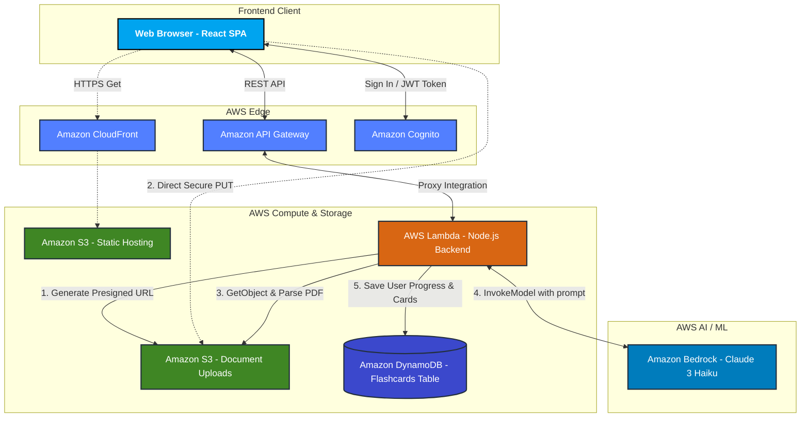

# Dyslexia Flashcards App - AWS Architecture

This document provides a comprehensive overview of the serverless architecture powering the Dyslexia Flashcards application. The architecture is designed to be highly scalable, extremely cost-efficient (paying only for actual usage), and fast.

## Architecture Diagram

## Component Breakdown

### 1. Frontend Hosting (Edge)
- **Amazon S3 (Web Bucket)**: Stores the static assets (HTML, CSS, JS) built by the React Vite application.
- **Amazon CloudFront**: A global Content Delivery Network (CDN) that caches the static assets at edge locations near the user, ensuring the app loads instantly regardless of geography.

### 2. Security & Authentication
- **Amazon Cognito**: Handles user registration, sign-in, and JWT token generation. The frontend uses the Amplify library to seamlessly interact with the User Pool, ensuring user sessions are secure and that gamification progress (points/streaks) can be safely tied to an identity.

### 3. Application API (Serverless Backend)
- **Amazon API Gateway**: Acts as the "front door" for our backend logic. It routes RESTful requests (`/presign` and `/generate`) from the browser to the backend compute layer.
- **AWS Lambda**: The core serverless engine of the app. Because it scales automatically and charges only for execution time, it's perfect for low-cost setups. It performs two main roles:
  1. **Presigning**: Generating temporary secure URLs for S3 uploads.
  2. **Generation Pipeline**: Downloading the document from S3, extracting the text from the PDF in memory, chunking it, and interacting with Bedrock.

### 4. Storage & State
- **Amazon S3 (Documents Bucket)**: A private bucket configured with strict CORS rules. Users upload their PDFs directly here using presigned URLs, bypassing API Gateway payload limits.
- **Amazon DynamoDB**: A highly scalable NoSQL database. It stores the final JSON flashcards and user state (like generated Deck IDs and timestamps). Fetching a previously generated deck from DynamoDB costs fractions of a cent, avoiding repeated costly AI model invocations.

### 5. Generative AI
- **Amazon Bedrock**: The fully managed foundational model service. The app invokes the **Claude 3 Haiku** model—Anthropic's fastest and most cost-effective model—using the Converse API. It evaluates the parsed text chunk and strictly formats the educational flashcards as JSON.

## Workflow Overview

1. The user logs in via **Cognito**.
2. The user selects a PDF. The React app requests a presigned URL from **API Gateway/Lambda**.
3. The React app uploads the PDF directly to **S3 (Documents)**.
4. The React app calls the `/generate` endpoint on **API Gateway**.
5. **Lambda** downloads the PDF from S3, uses `pdf-parse` to read the text, and constructs a prompt based on the user's age group.
6. **Lambda** invokes **Bedrock** with the prompt and text.
7. **Bedrock** returns the JSON flashcards.
8. **Lambda** saves the flashcards to **DynamoDB** and returns them to the React frontend.
9. The frontend displays the interactive flashcards.
